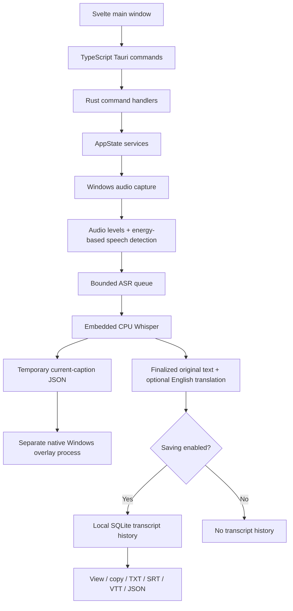
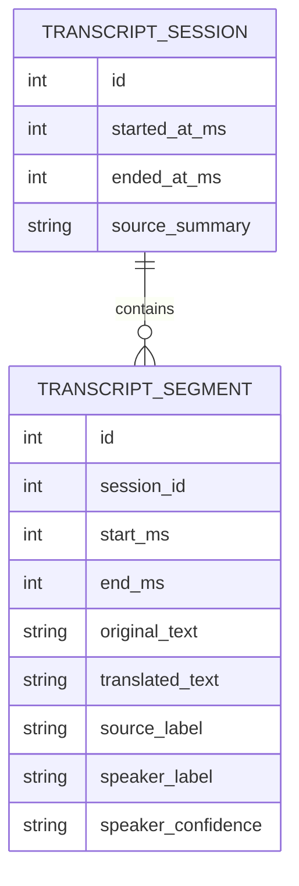

# Current app: FeelSay

**Implemented baseline: `develop` at `73f9b69`.** Windows desktop captions, built with Svelte + Tauri + Rust. This is the code map, not the proposed Secure MOM implementation.

## Runtime flow



1. User selects one microphone, playback device, or application.
2. **Start** checks the model; if missing, the UI invokes its download/repair operation.
3. Rust captures PCM audio, updates the level meter, detects speech, and sends frames to Whisper.
4. Whisper processes short growing segments for provisional captions, then finalizes them.
5. Display text goes to an ephemeral file read by the native subtitle overlay. Full original finalized text can go to SQLite.
6. **Stop** joins capture/recognition, finishes the transcript session, and removes current-caption state.

## Folder map

| Existing path | Responsibility | Start here when changing… |
|---|---|---|
| `src/routes/+page.svelte` | Main screen, source selection, Start/Stop orchestration | Main user journey |
| `src/lib/components/` | Source picker, settings, titlebar, transcript history | UI components |
| `src/lib/domain/` | TypeScript settings and data shapes | Frontend contracts |
| `src/lib/tauri/commands.ts` | Typed wrappers around native `invoke()` | Desktop-to-Rust calls |
| `src/app.css` | Shared styling | Visual design |
| `src-tauri/src/lib.rs` | Tauri setup, registered commands, lifecycle cleanup | Native startup |
| `src-tauri/src/commands.rs` | UI-callable handlers | Native API boundary |
| `src-tauri/src/app_state.rs` | Owns services and builds ASR configuration | Service wiring |
| `src-tauri/src/audio_capture.rs` | Windows capture, audio meter, speech detection | Microphone/playback input |
| `src-tauri/src/application_audio.rs` | Windows process audio capture | Application input |
| `src-tauri/src/asr.rs` | Whisper loading, streaming queue, recognition, finalization | Existing ASR |
| `src-tauri/src/model_settings.rs` | Model metadata, pinned base download/checksum | Existing model setup |
| `src-tauri/src/transcript.rs` | Consent, writer, SQLite, exports and deletion | Existing transcript history |
| `src-tauri/src/diarization.rs` | Experimental RMS/zero-crossing speaker heuristic | Read for limitations; do not treat as real diarization |
| `src-tauri/src/main.rs` | Executable modes and native Windows overlay | Overlay renderer |
| `src-tauri/src/platform/` | Platform capabilities/source discovery | Windows works; Linux/macOS providers are placeholders |
| `src-tauri/src/*settings.rs` | Persisted caption/appearance/performance settings | Existing preferences |
| `src-tauri/src/persistence.rs` | Atomic writes and ephemeral file handling | File persistence utilities |
| `tests/ui/` | Browser flows with mocked native IPC | Frontend behavior, not actual audio |
| `tests/native/` | Native overlay rendering regressions | Overlay only |
| `scripts/windows-build.ps1` | Windows test/lint/package helper | Native build |
| `docs/` | Original product history and engineering knowledge | Existing limitations |
| `hackathon/` | This competition plan | New task context |

Most Rust unit tests live inside their source files. `package.json` defines frontend commands; `src-tauri/Cargo.toml` defines native dependencies; `src-tauri/tauri.conf.json` defines packaging and the WebView.

## Current storage



Settings, models, and history live under `%APPDATA%/app.feelsay.desktop`. Saving defaults off. History is capped at 100 sessions / 64 MiB; exports have a separate limit. SQLite secure deletion is configured; this is not database encryption.

## What is reusable, and where it stops

| Useful today | Limitation for Secure MOM |
|---|---|
| Working local multilingual Whisper integration | Default is `ggml-base.bin`; GPU explicitly disabled; no measured hospital/code-switch accuracy |
| `AsrEngine` trait | Runtime still owns concrete `WhisperAsrEngine`; other model families are not interchangeable yet |
| Windows capture and shutdown handling | Audio is processed in memory; no durable meeting recording/replay path |
| Timestamped original text | No source asset IDs, word evidence, transcript revisions, or decision records |
| Transcript export/history | No MoM, owners/deadlines, approval, routing, or email |
| Svelte frontend | Calls Tauri directly; a standalone browser cannot perform these native calls |
| Speaker fields | Production normalization disables labels; heuristic is not a trained speaker model |

**Critical mismatch:** on ASR overload, queued speech is discarded to catch up. Non-speech frames are skipped. ASR errors can stop the capture flow. A meeting recorder must first persist audio independently, then process/retry it. Reusing the live caption queue unchanged would make complete minutes and audio evidence impossible.

Romanian/Russian are absent from explicit language choices, although automatic multilingual decoding is used. Adding two dropdown values does not establish sentence-level code-switch accuracy. English translation must remain separate from the original multilingual evidence.

## Existing verification and useful commands

The old status records Rust/UI/installer/capture tests and an English prerecorded fixture. Those were **not rerun for this documentation task**. Live microphone, broader language accuracy, and clean-machine checks remain listed gaps. No current Secure MOM performance or accuracy result exists.

```powershell
npm ci
npm run check
npm run test:ui
# Native prerequisites: VS Build Tools, Windows SDK, CMake, LLVM/libclang, Rust.
powershell -NoProfile -ExecutionPolicy Bypass -File scripts/windows-build.ps1 -Task test
```

Use [the existing README](../README.md) for complete native build instructions. Do not run Vite build and UI tests concurrently in one checkout: both modify `.svelte-kit`. Consult [engineering notes](../docs/ENGINEERING_NOTES.md) before debugging Windows bindings or capture.

