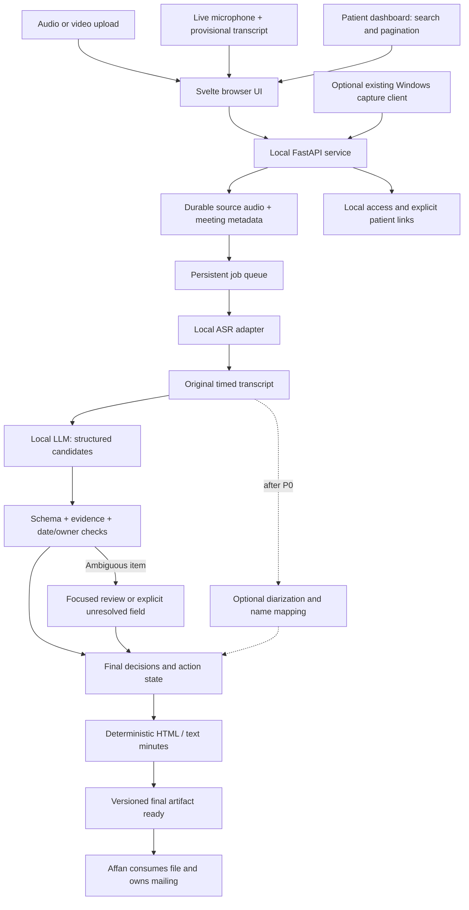

# Target architecture and shared contracts

**Proposed implementation; none of the new paths below exist in the baseline.** Keep this repository and Svelte. Add one local Python service for meeting jobs, ASR/LLM adapters, SQLite, and final documents. The PBI index governs today's implementation. Affan owns mailing; only the file boundary is specified here.

## One complete path



Inference may run in child processes to release VRAM cleanly. API stays responsive while jobs run. Use one GPU job at a time; a durable audio file survives worker failures. LAN UI/API/mail are local network traffic; no external endpoints or inference fallback.

## Required input modes

| Mode | Behavior | Timing |
|---|---|---|
| Audio upload | Accept tested WAV/MP3/M4A/FLAC formats; decode locally, retain source, index audio | 60-minute source: upload start to local email <=900 seconds |
| Video upload | Accept tested MP4/WebM containers; select the speech track, extract audio locally without video inference | Same target, including upload/demux/decode; record source size and transfer time |
| Live microphone | Start/Stop, timer/level, persisted-recording status, provisional timed transcript, then final minutes/email | Measure ongoing ASR lag and Stop-to-email separately; target <=900 seconds after a 60-minute meeting |

Format support is a tested codec/container matrix, not a promise that every file with those extensions decodes. Reject no-audio/corrupt media clearly; let the user choose among multiple audio tracks. No vision model is required. Long files are streamed to disk/decoded in bounded buffers, not loaded completely into RAM. Local video upload size can dominate wall time; benchmark a representative video as well as audio.

Browser capture on the demo host uses `localhost`; LAN browser microphones need trusted HTTPS. Persist sequenced, acknowledged recording chunks continuously before inference. MediaRecorder chunks may depend on earlier container headers: reassemble/demux the ordered stream; do not assume every blob is an independent WAV. Retry duplicates idempotently, detect missing sequences, and limit buffered unacknowledged bytes. If durable recording cannot continue, stop with a visible error rather than pretending audio was saved.

Live ASR consumes completed speech windows from the durable recording, with overlap/padding and stable source offsets. Emit replaceable provisional segments; keep final transcript revisions separate. On the 8 GB GPU, ASR owns the device during capture; final LLM extraction runs after Stop and ASR completion. Reuse valid completed ASR windows, finish any tail/backlog, then reconcile the whole meeting. A second full hour of ASR is not the default finalization step. Inference failure may delay the transcript but must not stop healthy recording.

References: [MediaRecorder chunk behavior](https://developer.mozilla.org/en-US/docs/Web/API/MediaRecorder/start), [microphone secure-context requirements](https://developer.mozilla.org/en-US/docs/Web/API/MediaDevices/getUserMedia). Browser permission denial, device removal, page close, and server loss need explicit UI states. Guaranteed recording after browser closure is outside the browser MVP; a native capture client can add that later.

## Reuse / change / add

| Existing asset | Plan |
|---|---|
| Svelte project, CSS, UI components | Reuse build system and useful visual primitives; add meeting pages with HTTP API |
| Tauri source picker/capture | Reuse if needed for native capture; required browser live mode follows first upload integration and persists audio independently |
| Native Whisper | Keep as existing caption capability/possible later CPU adapter; new batch worker first |
| SQLite/history ideas | Reuse patterns; separate meeting database so old history/schema are not accidentally migrated |
| Overlay and appearance settings | Remove launch from doctor flow, tray and shortcuts; retain legacy renderer pending separate cleanup |
| Model downloader | Reuse checksum lessons; new offline manifest/preflight governs the meeting pipeline |
| Patients, access, meeting API, jobs, LLM, minutes | New implementation; mailing belongs to Affan |

Entry: `/` doctor dashboard, with `/patients` and `/meetings` routes. Browser-safe components guard native imports/calls. No floating subtitle window opens in the doctor journey. Patient links are explicit operator metadata and never grant access to an entire multi-patient meeting. See [patient/data rules](09-patient-data-and-eu.md).

## Proposed additions and ownership

```text
src/routes/meetings/                 # App developer: home, setup, upload/record, progress, minutes
src/lib/components/meetings/         # App developer: reusable meeting UI
src/lib/api/meetings.ts              # App developer: HTTP client, no Tauri dependency
contracts/meeting.schema.json        # App developer owns; coordinate consumers
services/meeting/
  pyproject.toml + lockfile          # App developer: pinned Python environment
  api.py                            # App developer: meeting/job/profile endpoints
  contracts.py                      # App developer: strict validated models
  jobs.py + pipeline.py             # App developer: persistent states, stage orchestration
  storage.py                        # App developer: SQLite transactions and assets
  capture.py                        # App developer: chunk ingest, assembly, recording state
  adapters/asr.py + llm.py           # App developer: runtime-specific code
  decisions.py                      # App developer: final state and validation
  review.py                         # App developer: versioned edits, bounded issues, invalidation
  models.py                         # App developer: manifest/profile resolution
  rendering.py + templates/          # App developer: deterministic minutes
  artifacts.py                      # App developer: revision-bound final files
  auth.py + patients.py              # App developer: permissions and directory
  retention.py                      # App developer: deletion of derivatives
  speakers.py                       # App developer: later optional diarization/enrollment
  tests/                            # Owning developer: targeted tests
config/profiles/                     # App developer: laptop8, hospital16, cpu
models/manifest.json                 # App developer: artifact hashes and local paths
scripts/hackathon/                   # App developer: prepare, preflight, launch, smoke
evaluation/                         # App developer metrics; CEO gold labels and reports
External configured data directory  # Outside Git/OneDrive: DB, audio and outputs
```

Names describe boundaries, not a demand to create every file before the first result. Start with the few modules required for the vertical slice. The app developer owns contracts/migrations; Affan consumes the agreed file boundary. Model assignments are in the PBIs.

<details>
<summary><strong>Developer / AI appendix: shared contracts and implementation rules</strong></summary>

## Contract to freeze before parallel development

All times are integer milliseconds relative to the original asset; meeting date/timezone resolves relative dates. IDs are stable strings. Preserve Unicode, original text, and source audio. Version contracts and results.

| Object | Required fields / behavior |
|---|---|
| Meeting | `id`, title, recording date/timezone, selected type, suggested type, output language, participant list, explicit patient links, status |
| AudioAsset | `id`, meeting ID, local storage key, SHA-256, duration, channels, sample rate; source retained |
| Job | ID, meeting ID, state, current stage, error code, frozen resolved model config, timestamps, artifact references |
| Segment | ID, revision, asset ID, start/end, original text, optional words/language spans, nullable speaker cluster ID |
| Action | ID, task, nullable owner and due date, original date expression, status, independent task/owner/date evidence references |
| Evidence | Segment ID + revision + exact quote + start/end; validate reference and source bounds |
| ReviewIssue / TranscriptEdit | Exact revision/span, optional suggestions, disposition, actor and batch provenance; see [review contract](07-transcript-review.md) |
| Event | ID, item ID, kind `propose/confirm/amend/reject/cancel`, sequence, payload, evidence; acceptance assigned by validator |
| MoM snapshot | Meeting ID, revision, decisions/actions, unresolved items, source/model revisions, canonical content hash |
| OutputArtifact | Stable ID, meeting/snapshot revision, local path/storage key, MIME, checksum, ready/superseded/revoked status; format/trigger agreed with Affan |
| Patient / PatientLink | Opaque ID, organization scope, minimal display fields; operator-confirmed links with independent object permissions |

**P0 state:** accepted actions and rejected/unresolved items, with source references. Handle explicit final owner/date corrections across the whole meeting. **P1 expansion:** complete event history and interactive before/after evidence. Do not implement last-mention-wins: a later suggestion does not override a confirmed decision.

API proposal (freeze exact JSON with fixtures in PBI-001):

| Route | Behavior |
|---|---|
| `POST /api/meetings` | Validates metadata and authorized patient links; creates draft |
| `POST /api/meetings/{id}/audio` | Bounded audio/video upload; safe audio decode; durable source + hash |
| `POST /api/meetings/{id}/recordings` | Create live recording session with selected MIME/codec and sequence state |
| `PUT /api/recordings/{id}/chunks/{sequence}` | Idempotent ordered chunk ingest; acknowledge only after durable write |
| `POST /api/recordings/{id}/stop` | Seal recording after final chunk acknowledgment; finalize existing job |
| `POST /api/meetings/{id}/jobs` | Validates profile/assets, freezes config, queues processing |
| `GET /api/jobs/{id}` | State/stage/elapsed/errors; polling is enough initially |
| `GET /api/meetings/{id}` | Authorized meeting, transcript, minutes, artifact status |
| `GET /api/profiles` | Installed profile/model choices, backend compatibility and readiness |
| `GET /api/meetings/{id}/audio` | Authorized range/playback from stored asset; not arbitrary file paths |
| `PATCH /api/meetings/{id}/review` | P0: versioned correction and dependent-result invalidation |
| `PATCH /api/meetings/{id}/speakers/{cluster}` | Later: explicit cluster-to-participant mapping |

Job states: `queued -> decoding -> transcribing -> extracting -> validating -> rendering -> ready`. Processing failures retry from valid checkpoints; `needs_review` holds unresolved publication. Artifact readiness is separate from Affan's delivery outcome.

PBI-006 adds authenticated patient create/detail/search routes. Apply access filtering before search/count/pagination: default 25, maximum 100, stable normalized-name/ID cursor order. Protect media and exports as well as list pages.

Live recording state is independent: `starting -> recording -> stopping -> sealed`, or `interrupted`. ASR can be processing or failed while capture remains healthy. Poll the meeting for provisional segments initially; a new socket protocol is unnecessary for the MVP.

## AI implementation rules

- Decode arbitrary user files in a bounded subprocess with format, duration, and size limits. Keep paths generated by the server. Do not trust uploaded filenames.
- Run blocking inference off the API event loop. Save stage artifacts atomically and record completion only afterward.
- Chunk transcripts by timed segments with bounded overlap; extract compact candidates; reconcile all candidates globally so a late correction is not lost.
- LLM receives transcript as untrusted data and has no tools. It cannot choose recipients, invoke external URLs, set `verified`, or issue clinical orders.
- Validate output shape, cited segments/quotes, date interpretation, and explicit commitments. Structural validation alone does not prove semantic truth. Unknown owner/date stays null; ambiguous dose stays unresolved.
- Render official minutes from accepted state, escaping text. Do not ask another unconstrained generation pass to rewrite approved facts.
- Publish final files atomically with current snapshot revision/hash. Edits revoke/supersede eligibility; agree consumption semantics with Affan.
- Local authentication and object-scoped checks are P0, including loopback. Keep inference servers on loopback, assets local and sensitive files outside the OneDrive checkout. Trusted HTTPS is needed for LAN microphones. This is not a production-readiness claim.
- Source edits or speaker changes increment revision and invalidate affected extracted fields/snapshots. A distributed snapshot remains immutable; a correction creates a superseding version.
- Manual transcript editing/undo is P0; bounded AI error flags are P1. Follow [07](07-transcript-review.md) for keyboard UX, bulk replacement, Unicode spans, stale-edit conflicts, evidence rebuild and artifact handoff races. Unaccepted suggestions never enter authoritative text.

</details>
