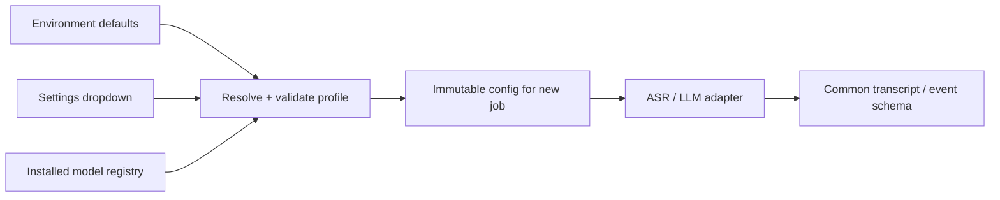

# Model switching and the 900-second budget

**Design and experiment plan, not a measured performance promise.** Confirmed by the user: RTX 3070 Ti Mobile with 8 GB VRAM and 24 GB system RAM; remote RTX 5080 with 16 GB VRAM available for comparison. Laptop power limits, drivers, usable memory, remote system RAM, and actual throughput still need measurement.

## Make configuration switchable



The dropdown updates persisted application configuration through the API. **It does not edit source code or rewrite a running process's environment.** A job freezes its configuration; changes affect subsequent jobs. Display the effective profile and why a choice is unavailable.

Proposed environment defaults:

```dotenv
MOM_PROFILE=laptop8
MOM_ASR_BACKEND=faster_whisper
MOM_ASR_MODEL=whisper-large-v3-local
MOM_ASR_COMPUTE_TYPE=int8_float16
MOM_ASR_BATCH_SIZE=1
MOM_ASR_BEAM_SIZE=5
MOM_LLM_BACKEND=llama_cpp
MOM_LLM_MODEL=qwen35-4b-q4km-local
MOM_MODEL_ROOT=C:/secure-mom/models
MOM_DATA_ROOT=C:/secure-mom/data
MOM_OFFLINE=true
```

These IDs are application aliases to be defined in the registry, not downloadable model names. Precedence: **explicit validated job selection > persisted UI preference > environment default > bundled profile default**. Deployment limits (allowed models/devices, local endpoints, maximum memory) override all user choices. Invalid configuration fails clearly before starting.

Registry entry: alias, task, backend, local artifact paths, upstream ID/revision, SHA-256 hashes, license, quantization, language capabilities, supported devices, context limits, benchmark status. A profile selects registered aliases plus batch/context/thread settings. Expose only fully installed, compatible choices.

Backend interface:

```text
ASR.transcribe(asset, config) -> timed original-language segments
LLM.extract(segments, meeting, schema, config) -> candidate events/actions
DIARIZER.cluster(asset, config) -> timed anonymous speaker turns  # optional
```

Adapters own native runtime details. Changing a checkpoint supported by an adapter is a configuration change. Switching to an entirely different model family still requires an adapter and contract tests once. Do not create fake universal support.

## First profiles to qualify

| Profile | Initial experiment | Scheduling | Qualification |
|---|---|---|---|
| `laptop8` | Full Whisper large-v3 via faster-whisper, `int8_float16`, beam 5, batch 1 initially; Qwen3.5-4B Q4_K_M | ASR unloads before LLM loads; bounded context | RTX 3070 Ti Mobile / 8 GB VRAM / 24 GB RAM; measure memory and power limits |
| `hospital16` | Same models and settings first; then compare batches 2/4/8 and FP16 against INT8 | Same sequential stages initially | Remote RTX 5080 / 16 GB VRAM; benchmark locally on that host with permitted data |
| `cpu` | Smaller/quantized multilingual ASR and compact quantized LLM | Bounded threads/RAM | Functional offline fallback; no 15-minute claim without a run |

Updated first ASR candidate: **`Systran/faster-whisper-large-v3`**, a CTranslate2 conversion of full Whisper large-v3. faster-whisper is the runtime; Turbo is a different checkpoint choice. Download during preparation, then load a pinned local directory. Use transcription rather than translation, with word timestamps; timing estimates do not certify the words. Do not assume automatic language detection handles intra-sentence switching correctly: test all three languages together.

Updated first LLM candidate: **Qwen3.5-4B Q4_K_M**, text-only use through a compatible pinned llama.cpp build and verified GGUF artifact. Pin its chat template and test constrained JSON plus the chosen thinking/non-thinking setting; cap output tokens. The upstream model card is not verification of a particular third-party GGUF or local runtime build. This supersedes the earlier Qwen3-4B-Instruct-2507 suggestion; no hospital-domain superiority has been measured.

**Batch 1 is a memory-safe starting experiment, not the final speed choice.** After measuring peak VRAM and accuracy, try batch 2 and 4 on the laptop too. Keep beam 5 as the quality baseline; compare smaller beams only on the same held-out cases. Full large-v3 may fit without requiring Turbo, but the 900-second end-to-end run decides whether its quality/speed tradeoff works. Keep Turbo as the second ASR checkpoint to compare, not an automatic quality downgrade based only on 8 GB VRAM.

Parakeet TDT 0.6B v3 remains P2: an optional independent recognizer for selected difficult spans, loaded in a separate stage. Its published language list includes RO/RU/EN; that does not establish our mixed-sentence performance. Do not add it until P0 succeeds and a paired test demonstrates useful corrections within the time budget.

Official references checked 25 September 2026:

- [faster-whisper](https://github.com/SYSTRAN/faster-whisper): local CTranslate2 inference, quantization and batching. Published benchmark hardware/audio differ from ours; do not copy its timings into our claims.
- [Whisper conversion](https://huggingface.co/Systran/faster-whisper-large-v3): full large-v3 in CTranslate2 format; compute precision can be selected at load time.
- [Qwen model card](https://huggingface.co/Qwen/Qwen3.5-4B): candidate model provenance. Pin the exact conversion, license, tokenizer, template, and runtime used.
- [Parakeet model card](https://huggingface.co/nvidia/parakeet-tdt-0.6b-v3): optional multilingual challenger, separately evaluated.
- [llama.cpp server](https://github.com/ggml-org/llama.cpp/blob/master/tools/server/README.md): local inference and schema-constrained output. It supports a subset of schema behavior; always validate parsed output afterward.

The faster-whisper README includes an RTX 3070 Ti 8 GB benchmark using **large-v2**: INT8/beam 5 uses about 2.9 GB VRAM unbatched, versus about 4.5 GB at batch 8. This supports trying a full large model on 8 GB; it is not a large-v3 Mobile, word-timestamp, or complete MoM benchmark. Do not extrapolate a guaranteed one-hour processing time from it.

First hardware check: usable GPU memory, backend/driver compatibility, RAM/free disk, CPU, power mode. On the RTX 5080, qualify the actual driver/CUDA/CTranslate2/llama.cpp combination early; the laptop's working binaries are not automatically a validated Blackwell stack. Query supported compute types and run a real decode. Pin versions per platform if needed while keeping model hashes/fixtures consistent. Do not install several experimental runtimes during the final day.

## Use the remote 16 GB machine as a benchmark host

1. Deploy the same commit and initially the same model hashes/settings to both hosts. Use synthetic or explicitly permitted recordings; availability of remote compute does not grant permission to transfer organizer/hospital data abroad.
2. Run the **complete pipeline on each host**, including local model inference and local Mailpit. Report each machine's RAM, GPU, runtime, stage times, total time, quality, and peak memory.
3. Compare identical settings first, then tune each profile independently. Record remote transfer/setup time separately; do not present WAN upload as local-hospital processing.
4. Keep the demo laptop fully standalone. Calling the overseas GPU over the internet during inference would violate the supplied brief's on-premise/no-external-call requirement, even if we own the server or use a VPN.
5. Remote development/SSH access is not an offline demonstration. Separate management access from isolated worker egress tests, and prove a genuinely disconnected end-to-end run on the laptop. Never claim the entire remote host has no WAN traffic while controlling it over WAN.

The 5080 run provides evidence for one 16 GB GPU configuration, not every 16 GB GPU or the exact hospital installation. The laptop's 24 GB system RAM is a separate constraint: avoid retaining several models/processes or duplicating long audio buffers. Its CPU mode is not qualification of the brief's 32 GB RAM CPU reference.

## Memory policy

- Single GPU admission lock; no ASR, LLM, and diarizer competing for VRAM.
- Prefer stage child processes; process exit gives a clear memory-release boundary.
- Measure peak VRAM/RSS. Start with conservative memory headroom; do not treat parameter size as total memory.
- On OOM, restart the failed stage with a smaller batch/context profile, preserving audio and prior valid checkpoints. Record the changed config. Never silently use cloud inference.
- Cache valid ASR output by source hash + preprocessing/model/decoder configuration. Transcript edits invalidate downstream output, not the original asset.

## Time target for one hour

`RTF = total pipeline seconds / 3600`; target **RTF <= 0.25**.

| Stage | Initial engineering budget, seconds |
|---|---:|
| Upload, decode, audio indexing | 60 |
| Model startup/load transitions | 90 |
| ASR | 240 |
| Extraction + global reconciliation | 300 |
| Validation + rendering + local email | 45 |
| Margin / narrowly targeted retry | 165 |
| **Total ceiling** | **900** |

These are budgets to investigate, not expected measurements. Baseline budget excludes optional diarization: it must fit available margin or earn time through measured optimization. If included in published minutes, its time counts.

Optional AI transcript flags share the extraction stage/model load and must fit its budget or measured margin. Bound candidates and token output; do not add an unconditional full-transcript rewrite. Correction-triggered regeneration reuses ASR and re-extracts affected context before global reconciliation. Report review time and repeat-processing cost separately; see [07](07-transcript-review.md).

Qualify **audio upload, video upload, and live mode** separately. Video tests include extracting the audio track and transfer time. Live recording lasts the actual meeting duration: it cannot finish a 60-minute meeting in 15 minutes from Start. Track ASR lag during recording and finalization from Stop to local email (target <=900 seconds); reuse completed windows and finish only the tail/backlog before LLM reconciliation. A fast live finalization result does not prove the one-hour uploaded-file target. Hold the LLM until capture/ASR complete on the 8 GB profile.

The primary clock starts when upload begins and ends when Mailpit receives the document. Also record receipt-to-email separately for diagnosis. Report an additional cold total from service launch through receipt, including startup/model loading; a warm run reports what remained loaded. A network-disconnected cold start preserves prepared model files. Human review time is reported separately, and user-observed total is also shown; do not hide it in the speed claim.

## Optimize in this order

1. **Measure stages on the actual laptop.** A five-minute clip eliminates failures; a real one-hour recording is the acceptance test.
2. Batch final transcription once. Do not repeatedly decode growing windows as the caption path does.
3. Use speech segmentation with padding and source-time mapping. Check missing negations at boundaries and overlapping speech.
4. Bound extraction output and context. Summarize candidates into structured fields, then reconcile them; avoid repeated full-transcript passes or long reasoning output.
5. Tune batch size, quantization and model size using paired quality results. Preserve raw output and test numbers/names after every change.
6. Add selective retries only for observed high-risk spans. No second full ASR pass in the default profile.

Hold original RO/RU/EN text throughout. Do not translate the whole recording into English first. Test language auto-detection and chunk behavior on genuine mixed sentences; “multilingual model” is not proof of mixed-sentence accuracy.

## Offline preparation

Download and pin every model, tokenizer, VAD/diarization asset, runtime dependency, font, and frontend bundle before disconnecting. Preflight verifies hashes and local paths. Disable runtime downloads/telemetry in dependencies and deny external egress at the host/container boundary. A missing model is a setup error. Record allowed LAN destinations; local SMTP must have no external relay.

Run the hour test at today's PBI-017 checkpoint (see the PBI index). If it exceeds 900 seconds, identify the largest stage, cap redundant tokens/retries, and reduce batch/context/model only with quality regression checks. Treat an unmet target honestly; neither the old English fixture nor a faster GPU extrapolation proves success.
