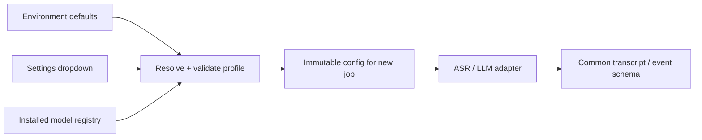

# Model switching and the 900-second budget

**Design and experiment plan, not a measured performance promise.** An 8 GB GPU is potentially usable, but vendor, backend support, laptop power limits, system RAM, context size, and free VRAM determine the result.

## Make configuration switchable



The dropdown updates persisted application configuration through the API. **It does not edit source code or rewrite a running process's environment.** A job freezes its configuration; changes affect subsequent jobs. Display the effective profile and why a choice is unavailable.

Proposed environment defaults:

```dotenv
MOM_PROFILE=laptop8
MOM_ASR_BACKEND=faster_whisper
MOM_ASR_MODEL=whisper-turbo-local
MOM_LLM_BACKEND=llama_cpp
MOM_LLM_MODEL=qwen4b-instruct-q4-local
MOM_MODEL_ROOT=C:/secure-mom/models
MOM_DATA_ROOT=C:/secure-mom/data
MOM_OFFLINE=true
```

These IDs are application aliases to be defined in the registry, not downloadable model names. Precedence: **explicit validated job selection > persisted UI preference > environment default > bundled profile default**. Deployment limits (allowed models/devices, local endpoints, maximum memory) override all user choices. Invalid configuration fails clearly before starting.

Registry entry: alias, task, backend, local artifact paths, upstream ID/revision, SHA-256 hashes, license, quantization, language capabilities, supported devices, context limits, benchmark status. A profile selects registered aliases plus batch/context/thread settings. Expose only fully installed, compatible choices.

Backend interface:

```text
ASR.transcribe(asset, config) -> timed original-language segments
LLM.extract(segments, meeting, schema, config) -> candidate events/actions
DIARIZER.cluster(asset, config) -> timed anonymous speaker turns  # optional
```

Adapters own native runtime details. Changing a checkpoint supported by an adapter is a configuration change. Switching to an entirely different model family still requires an adapter and contract tests once. Do not create fake universal support.

## First profiles to qualify

| Profile | Initial experiment | Scheduling | Qualification |
|---|---|---|---|
| `laptop8` | Whisper turbo in faster-whisper, INT8/FP16 where supported; compact ~4B instruct LLM in GGUF Q4 | ASR unloads before LLM loads; small batches and bounded context | Actual 8 GB laptop; leave memory for desktop/runtime |
| `hospital16` | Same baseline first; compare large-v3 or increased batch only if quality/speed improves | Same sequential stages initially | Actual 16 GB device if available; otherwise explicitly untested |
| `cpu` | Smaller/quantized multilingual ASR and compact quantized LLM | Bounded threads/RAM | Functional offline fallback; no 15-minute claim without a run |

Candidate LLM for the first compact experiment: **Qwen3-4B-Instruct-2507**, using a verified local GGUF conversion and supported llama.cpp build. This is a bounded starting choice, not evidence of Romanian medical superiority. The HTML's newer/larger candidates remain alternatives after the initial path works. Limit initial competition to two ASR candidates and one LLM; expand only to solve measured errors.

Official references checked 25 September 2026:

- [faster-whisper](https://github.com/SYSTRAN/faster-whisper): local CTranslate2 inference, quantization and batching. Published benchmark hardware/audio differ from ours; do not copy its timings into our claims.
- [Qwen model card](https://huggingface.co/Qwen/Qwen3-4B-Instruct-2507): candidate model provenance. Pin the exact conversion, license, tokenizer, template, and runtime used.
- [llama.cpp server](https://github.com/ggml-org/llama.cpp/blob/master/tools/server/README.md): local inference and schema-constrained output. It supports a subset of schema behavior; always validate parsed output afterward.

First hardware check: GPU vendor/model and usable memory, backend/driver compatibility, RAM/free disk, CPU, power mode. If CUDA is unavailable, qualify a supported local backend or CPU mode before promising speed. An 8 GB label alone is insufficient. Do not install several experimental runtimes during the final day.

## Memory policy

- Single GPU admission lock; no ASR, LLM, and diarizer competing for VRAM.
- Prefer stage child processes; process exit gives a clear memory-release boundary.
- Measure peak VRAM/RSS. Start with conservative memory headroom; do not treat parameter size as total memory.
- On OOM, restart the failed stage with a smaller batch/context profile, preserving audio and prior valid checkpoints. Record the changed config. Never silently use cloud inference.
- Cache valid ASR output by source hash + preprocessing/model/decoder configuration. Transcript edits invalidate downstream output, not the original asset.

## Time target for one hour

`RTF = total pipeline seconds / 3600`; target **RTF <= 0.25**.

| Stage | Initial engineering budget, seconds |
|---|---:|
| Upload, decode, audio indexing | 60 |
| Model startup/load transitions | 90 |
| ASR | 240 |
| Extraction + global reconciliation | 300 |
| Validation + rendering + local email | 45 |
| Margin / narrowly targeted retry | 165 |
| **Total ceiling** | **900** |

These are budgets to investigate, not expected measurements. Baseline budget excludes optional diarization: it must fit available margin or earn time through measured optimization. If included in published minutes, its time counts.

The primary clock starts when upload begins and ends when Mailpit receives the document. Also record receipt-to-email separately for diagnosis. Report an additional cold total from service launch through receipt, including startup/model loading; a warm run reports what remained loaded. A network-disconnected cold start preserves prepared model files. Human review time is reported separately, and user-observed total is also shown; do not hide it in the speed claim.

## Optimize in this order

1. **Measure stages on the actual laptop.** A five-minute clip eliminates failures; a real one-hour recording is the acceptance test.
2. Batch final transcription once. Do not repeatedly decode growing windows as the caption path does.
3. Use speech segmentation with padding and source-time mapping. Check missing negations at boundaries and overlapping speech.
4. Bound extraction output and context. Summarize candidates into structured fields, then reconcile them; avoid repeated full-transcript passes or long reasoning output.
5. Tune batch size, quantization and model size using paired quality results. Preserve raw output and test numbers/names after every change.
6. Add selective retries only for observed high-risk spans. No second full ASR pass in the default profile.

Hold original RO/RU/EN text throughout. Do not translate the whole recording into English first. Test language auto-detection and chunk behavior on genuine mixed sentences; “multilingual model” is not proof of mixed-sentence accuracy.

## Offline preparation

Download and pin every model, tokenizer, VAD/diarization asset, runtime dependency, font, and frontend bundle before disconnecting. Preflight verifies hashes and local paths. Disable runtime downloads/telemetry in dependencies and deny external egress at the host/container boundary. A missing model is a setup error. Record allowed LAN destinations; local SMTP must have no external relay.

By H24, run the hour test. If it exceeds 900 seconds, identify the largest stage, cap redundant tokens/retries, and reduce batch/context/model only with quality regression checks. Treat an unmet target honestly; neither the old English fixture nor a faster GPU extrapolation proves success.
