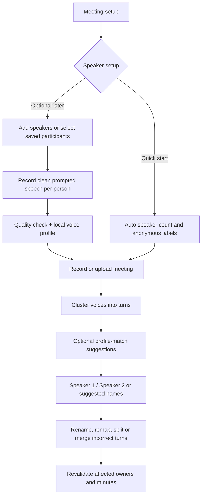

# Speakers: useful, but after the required pipeline

**Feasible:** automatic speaker separation, manual name assignment, and later optional voice enrollment. **Recommendation:** within speaker work, ship automatic anonymous labels plus correction first. Across the product, finish P0 and targeted transcript review/replay before diarization. Persistent voice recognition is a stretch feature in 48 hours; diarization itself is a bonus in the challenge.

## Three different jobs

| Capability | Answers | Implementation |
|---|---|---|
| Diarization | When did each distinct voice speak? | Turn segmentation + speaker embeddings + clustering |
| Identification | Which known person matches this voice? | Compare meeting embeddings with enrolled profiles; allow unknown |
| Action ownership | Who agreed to do the task? | Language/evidence reasoning; may be someone other than the speaker |

“Elena will handle this” can establish Elena as an owner without identifying the person speaking. “I'll handle this” needs the speaker identity or an unresolved owner. Do not conflate speaker labels with action owners.

## Planned UX

### P1: quick mode and correction

- Setup can suggest two participants but must support **Add speaker**, unknown count, or skipping participant setup.
- Optional known/minimum/maximum speaker count guides clustering; do not force two if another voice appears.
- Output stable meeting-local clusters such as Speaker 1. User can map a cluster to a selected participant or new name.
- Rename the cluster across the meeting; also allow turn-level correction for a merged/misclassified voice. Renaming alone cannot fix bad segmentation.
- Keep overlapping speech/uncertain turns explicit. Only confirmed mappings support named first-person commitments.
- Persist corrections with actor/revision. Recompute dependent owner fields and create a revised MoM if already delivered.

Candidate: [pyannote Community-1](https://huggingface.co/pyannote/speaker-diarization-community-1). Its model card describes local/offline use after acquisition and speaker-count controls. Acquire gated assets/accept terms during preparation. Benchmark runtime and turn attribution on our meetings; no existing accuracy claim applies to our room. This supplies diarization, not a finished persistent employee-recognition feature.

### P2: optional enrollment and recognition

1. Add/select person; explain local voice-profile storage and offer deletion.
2. Display a short neutral prompt in their preferred language; request roughly **20–30 seconds** of clean solo speech as an initial UX trial. Validate this duration empirically; one short sentence can be too fragile.
3. Detect insufficient speech, clipping, another speaker, and poor level; let the user retry.
4. Extract several embeddings using the same pinned embedding model as matching. Store model/version, quality indicators, name/person ID, and consent metadata. Do not fine-tune ASR per person.
5. During a meeting, compare clean cluster embeddings against the **selected consenting participant set**. Require calibrated score threshold and margin over the next candidate; otherwise leave unknown.
6. Show a suggested identity until confirmed. If optional automatic acceptance is later enabled, qualify it on held-out same/different-person recordings first.

Returning profiles can skip reciting the prompt, with an optional fresh room sample. Match the current room/microphone conditions where possible. Accent, illness, noise, overlap, and channel changes can alter matching quality. Never interpret similarity as authentication or a calibrated probability without testing.

Suggested profile fields: `person_id`, display name, enrollment status, embedding model/hash, embedding samples, quality metadata, consent/deletion metadata. Cluster mapping is meeting-specific; it must not silently rewrite the saved enrollment. Voice templates remain sensitive even if raw enrollment audio is deleted; exclude them from Git/logs and protect local storage/access.

## Go / no-go

| Gate | Add feature only when… |
|---|---|
| Diarization | P0 is green, assets run offline, and measured time fits the total budget |
| Name correction | Speaker labels exist; editing a label invalidates affected extraction |
| Enrollment | Diarization is stable, mandatory gates remain green, and at least one bounded development block remains |
| Automatic identity | Known and unknown speaker tests quantify false matches; UI has an unknown state and correction |

Tests: one/two/three speakers, unseen speaker, same person on another microphone, overlap, profile swap, mistaken cluster merge, and first-person action attribution. Measure false identity assignments as well as correct matches. If this is unreliable, retain anonymous labels and manual names for the demo.
