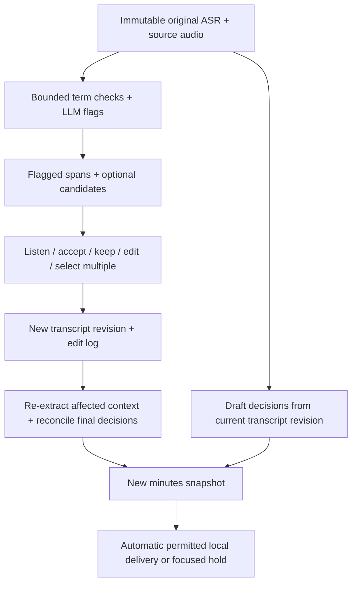

# Transcript review: find, listen, correct

**Proposed feature; not implemented.** Basic manual editing is P0. AI flags and the fast review queue are the first P1 enhancement, before diarization/enrollment. Goal: correct consequential recognition errors with a few deliberate actions while preserving what the recognizer originally produced.

## What the AI can and cannot establish

A local LLM can flag inconsistent repeated terms, unlikely wording, entity/name variants, and possible errors around decisions. It can suggest alternatives using nearby turns and an approved local glossary. A text-only LLM cannot hear the recording or establish that two words actually sounded alike. Similar spelling, context, or repeated occurrence provides a candidate, not proof. Correct rare terms and genuine language switches must survive.

Return **suspected errors**, never claim all errors were found. The most frequent spelling may itself be wrong. A speaker may have changed topic or corrected themselves. Preserve an unusual but genuinely spoken statement instead of silently making it medically plausible.

Research establishes ASR error correction/detection as a real task, but does not establish performance of our local model on RO/RU/EN hospital speech: [multilingual LLM correction study](https://www.isca-archive.org/interspeech_2024/li24h_interspeech.pdf), [audio-transcript error detection study](https://www.isca-archive.org/interspeech_2022/meripo22_interspeech.html). Our acceptance evidence must come from held-out recordings and human references.

## Reviewer experience

```text
Transcript                         Review: 3 of 8     [Previous] [Next]
... highlighted suspect phrase ... Reason: inconsistent term in this meeting
                                   Original: [exact source wording]
[Play nearby audio]                Suggested: [candidate] [alternative]
                                   [Accept] [Keep original] [Edit] [Later]
                                   [ ] Select this occurrence
                                   [Select matching occurrences]
                                   [Preview 4 replacements] [Apply selected]
```

- Highlights use an underline/icon plus color, with separate treatment for suspected errors and accepted edits. Transcript stays readable with flags hidden.
- Show original phrase, nearby context, suggestion(s), and a concise reason. “Needs review” is valid without a suggested replacement. Do not invent confidence percentages.
- Previous/Next and a result counter work like a find panel. Up/Down move between issues **when the review list has focus**; preserve normal cursor movement in text fields. Enter opens the selected issue; visible controls remain keyboard accessible. Do not intercept browser Ctrl+F.
- Audio replay opens a short source interval with context and expandable boundaries. Fall back to segment timing if a reliable word interval is unavailable.
- Reviewer can accept one suggestion, choose an alternative, type a replacement, keep the original, defer, or edit any unflagged text. Keeping original and deferring are different persisted states.
- Group repeated candidate terms, show each occurrence's surrounding sentence, and allow multi-selection. A correction to one occurrence never silently changes the others.
- **Approve all suggestions** first opens a before/after preview with exact occurrence count and scope. Batch only explicit replacements; unresolved flags without a replacement stay open. High-impact changes involving drug identity, numbers/units, negation, names, or deadlines require occurrence-level review and remain outside one-click bulk approval.
- Manual **Replace selected occurrences** supports a user-entered term and selected matches throughout the meeting. Use explicit span matches, not a blind substring replacement. Preview exclusions/overlaps. Provide batch undo.
- After applying edits, show “Updating affected minutes” and then the revised result. Do not leave a changed transcript beside stale decisions or email text.

## Data flow



Unaccepted suggestions never enter authoritative text or minutes. If a flagged uncertainty affects a proposed published commitment, owner, date, or clinical value, hold that field/item or mark it unresolved under existing publication policy. Harmless flags must not block the entire meeting. Unflagged/valid output retains automatic delivery; do not make every user approve every word.

After delivery, edits create a superseding snapshot and message; the original message remains immutable. Mark minutes' review state accurately. Never imply a doctor approved an automatically generated document.

## Developer / AI contract

Proposed files: `services/meeting/review.py`, `src/lib/components/meetings/transcript-review.svelte`; extend existing proposed contracts/storage/meeting API instead of creating another pipeline. Dev A owns candidate generation, validation and revisions. Dev B owns selection, keyboard navigation, replay, preview and undo.

| Record | Fields / rule |
|---|---|
| ReviewIssue | ID, meeting ID, segment ID/revision, start/end text offsets, exact original substring, reason code, optional candidate replacements, risk category, status, model/config provenance |
| Candidate evidence | Other segment references, approved glossary term ID, decoder alternative if available; distinguish textual support from acoustic evidence |
| TranscriptEdit | ID/batch ID, actor/time, base/new revision, original span, replacement, originating issue or manual reason |
| Batch request | Meeting/base revision, explicit occurrence IDs/spans and replacements; expected originals; idempotency key |

Use Unicode code-point offsets with half-open ranges; convert JavaScript UTF-16 offsets at the API boundary. Validate the exact original substring against its revision. Candidate text cannot set approval state. Limit output size and candidate count; reject nonexistent spans, overlapping edits, and unbounded model prose.

Apply a reviewed batch atomically with optimistic revision checking. Reject a stale batch rather than patching the wrong words. Preserve immutable source revisions; compute new display offsets and regenerate/invalidate affected flags. Undo creates a new inverse edit revision; it does not erase the audit trail. Replacement words retain the original supporting audio interval and are labeled human-edited, not falsely word-aligned by ASR.

Proposed API additions: `GET /api/meetings/{id}/review-issues`; `POST /api/meetings/{id}/transcript-edits`; `POST /api/meetings/{id}/transcript-edits/{batch}/undo`. Existing review endpoint can handle issue disposition; agree one implementation with Dev A. Responses return revision, changed issue IDs, and downstream status.

Invalidate affected evidence, extracted events and unsent snapshots. Re-extract enough surrounding context, then reconcile globally because a local edit can alter a late correction or earlier action reference. Before SMTP submission, verify the snapshot is still current and eligible. Already submitted mail is superseded explicitly. Never send stale minutes during an edit/rebuild race.

## Fit within the processing budget

First collect inexpensive candidates from repeated term variants and glossary mismatches. Ask the already loaded LLM for bounded flags alongside its extraction response, with enough neighboring text to avoid false corrections. Only add a separate targeted pass if measured recall requires it. Reuse the LLM load, cap generated tokens, and avoid a second unbounded rewrite of the whole transcript.

All automatic flagging time counts in the 900-second machine budget. Reviewer time and total delivery delay are also reported separately. Store rejected suggestions so the same unchanged revision does not nag the user repeatedly. A second ASR can later check selected clips, but is not required for the review UI.

## Acceptance and kill gate

- Manual edit, multi-select preview/apply, keep/defer, undo, Unicode offsets, overlap rejection and stale-revision conflicts work.
- Raw source text/audio is unchanged; edited display and dependent minutes agree after rebuild.
- Review finds some real errors on held-out audio and preserves correct unusual terms and code-switches; no universal recall claim.
- Test repeated term with one true variant, consistently wrong repeated term, out-of-glossary name, ambiguous number, actual negation, mid-sentence switch, and editing during pending delivery.
- Report **raw ASR accuracy**, **automatic flag precision/recall**, **suggestion correctness**, **human-reviewed accuracy**, and **review time/actions** separately. Also count correct words the system wrongly recommends changing.
- Compare assisted review with ordinary editing on matched unseen clips; counterbalance order/reviewers where possible. Do not attribute human corrections to ASR model improvement.
- H32–H36 experiment after P0 passes: if flags create excessive unnecessary work or regress the time gate, retain manual editing/replay and disable AI suggestions in the release. No new model is needed to keep the feature useful.

