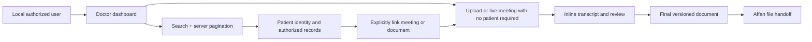

# Patients, data protection and EU deployment

**26 September 2026. Planning baseline for the new dashboard.** Implement through [the PBI backlog](pbis/README.md). Today uses fictional patients and permitted evaluation recordings; real patient use requires the reviewed pilot gate. On-premise operation is one control, not a compliance certificate.

## Minimal patient workflow today

Minimal patient fields: opaque ID, organization ID, display name, optional hospital reference, status, timestamps. Use fictional demo identities. Provide create/update, search, detail, recent authorized linked records and cursor pagination (25 default, 100 maximum). Extra identifiers or clinical data need a stated purpose.

Meeting-participant identity, enrolled voice identity, authenticated user and patient identity are different records. An AI-mentioned name must never automatically create a patient or link a record. A doctor confirms the association. A patient link does not grant permission to the meeting, and a multi-patient meeting must not expose all its text through one patient's page. Check both permissions; patient-specific extracts need explicit scope review before release.

Use a main-window workspace: dashboard -> meeting -> transcript/review -> document. No floating captions. Keep legacy renderer code until a later justified cleanup; remove its launch/actions from the new product path.

## Practical controls to implement today

| Concern | Concrete behavior | PBI |
|---|---|---|
| Least access | Local accounts, assigned records, protected search/count/source/export; roles do not bypass object checks | 005–007 |
| Data minimization | Minimal patient fields; user-confirmed links; no extra patient details in normal output | 001, 006, 010 |
| Local storage | Data outside Git/OneDrive and other synced folders; no sensitive filenames/log text; explicit encryption setup evidence | 002, 015 |
| Corrections | Immutable ASR/source, versioned human edits, affected minutes rebuilt, stale artifact revoked | 013–014 |
| Retention | Configured demo periods, actual deletion behavior, derivative inventory, backups/external-copy limitations visible | 015 |
| Offline proof | All model/UI assets prepared; no external inference; remote 5080 only uses permitted benchmark data | 003, 016–017 |
| Human oversight | Unknown values stay unknown; optional suggestions never overwrite facts; no clinical order entry | 009, 018 |

Access tests must cover non-UI paths: guessed IDs, audio range requests, old artifact versions, job progress, patient search and counts. Avoid caching patient content in browser persistent storage. Explicitly selected download files are governed exports, not ordinary UI cache.

## Legal scope to review before real patient use

GDPR applicability depends on territorial/material scope, not just choosing an EU market. Health data receives special-category protection. Determine an Article 6 basis and applicable Article 9 condition; recording notices or a consent checkbox alone do not establish lawful processing. Privacy by design/default, security, purpose/retention limits, rights, and impact assessment where high risk are relevant. Pseudonymized records remain personal data when re-identification is possible. Biometric templates used to uniquely identify people need separate scrutiny. Assess controller/processor duties and international transfers for the actual deployment. [GDPR text](https://eur-lex.europa.eu/legal-content/EN/TXT/?uri=CELEX%3A32016R0679), [EDPB legal-basis guidance](https://www.edpb.europa.eu/topics/key-gdpr-concepts/legal-basis_en).

Country-specific health-record retention, confidentiality and access requirements need hospital/DPO review. Do not promise immediate deletion where a justified preservation duty or legal hold applies. The real-data gate is a recorded review with accountable owners, not a flag a coding agent sets to “compliant.”

AI Act risk/obligations depend on intended use and deployment. The Commission's implementation timeline has changed; recheck the current rules at pilot approval instead of copying an old deadline. This plan makes no automatic high-risk/exempt classification. [Commission AI Act guidance](https://digital-strategy.ec.europa.eu/en/policies/regulatory-framework-ai).

MDR/IVDR software qualification similarly needs intended-purpose assessment. Documentation and storage features do not establish permission to add diagnostic/treatment recommendations. Reassess if clinical decision support enters scope, using the Commission's MDCG 2019-11 rev.1 guidance and qualified review. [Official MDCG guidance catalogue](https://health.ec.europa.eu/medical-devices-sector/new-regulations/guidance-mdcg-endorsed-documents-and-other-guidance_en).

## Ethics and EU market path

- Test RO/RU/EN, accents, noise, overlap and code-switches separately. Report who checked references and where reviewer expertise is missing.
- Measure false corrections/identities and review burden. Preserve the speaker's actual words even when context seems unusual; don't turn polished phrasing into a medical fact.
- Keep voice enrollment optional with a functional skip path. No emotion detection, staff surveillance/ranking or secondary model training in this product plan.
- Before pilot: data inventory, documented purpose/roles, applicable lawful grounds, DPIA screening/completion where required, notices/rights workflows, incident response, hospital security and retention approval (PBI-022).
- For scale: first isolated hospital deployments with tested install/restore/upgrade; then evidence-based database/workers changes. Add country/language/terminology packs, hardware qualification, software supply-chain maintenance and reviewed EHR adapters (PBI-023).
- A shared multi-hospital SaaS deployment is a later product/architecture/legal decision, not an assumed consequence of adding organization IDs today.

No mailing architecture is specified here. Final files remain sensitive exports; Affan's component is a separate recipient of the agreed artifact, and its data lifecycle must be coordinated during a real pilot.
