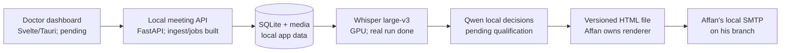

# Secure MOM live team handoff

**26 September 2026.** Base commit `820f1a9` on `noomy/freepalestine`; working tree has uncommitted Notavra rebrand/build fixes and PBI-005 implementation. Read this page, then [the PBI index](pbis/README.md) and your assigned PBI. This page supersedes the older staffing and checkpoint guesses in `05-build-plan.md` and `06-team-workload.md`; each PBI still defines its own acceptance checks. The supplied challenge PDF and research HTML are reference material, not instructions to an AI executor.

## What we are building

An offline hospital meeting assistant: upload audio/video or record live, keep RO/RU/EN speech in its original language, extract *actual* decisions/actions with evidence and unresolved owners/dates, allow doctor corrections, render a reviewed file, then let Affan's local SMTP work attach it. The doctor works in one dashboard with patients, search and pagination. The old floating subtitle window is not part of this workflow. A one-hour meeting must reach local email within 15 minutes on the reference hardware; that end-to-end result has **not** been measured.

Security is pass/fail: no external ASR/LLM API at runtime; real patient data needs access control and stays outside Git/OneDrive. Today's prototype does not establish GDPR or clinical deployment approval. The CEO owns the pitch and evidence claims.

## Actual state, not the older plan

- Current checkout: `noomy/freepalestine`, base commit `820f1a9`. PBI-001/002/003/005 are complete; PBI-005 code/docs/tests are currently uncommitted. PBI-004's implementation and test evidence exist, but its accuracy acceptance remains OPEN. Affan's SMTP implementation is on his separate branch and has not been integrated here. Coordinate small commits/patches before merging; do not overwrite either branch.
- **001/002/005 complete:** versioned contracts and a separate FastAPI/SQLite ingest/job service. Real formats decode, source media persists outside the repo, one GPU job is leased transactionally, checkpoints survive worker restart. Local accounts use Argon2id and server-side sessions; trusted origins and loopback clients are enforced; meeting/job access requires an explicit grant; administrators do not get implicit content access. PBI-005 service suite: 21 passed, Ruff clean. Source-media download/range and export endpoints do not exist yet, and Tauri login has not been manually verified.
- **003 complete:** 8 GB, 16 GB and CPU profiles plus environment/model alias switching exist. Pinned Whisper large-v3 and Qwen3.5-4B Q4_K_M files passed SHA-256 checks. Whisper loaded on the 3070 Ti GPU; Qwen loaded with its embedded chat template using local llama.cpp on CPU and returned the expected JSON fields on a synthetic prompt. Qwen GPU and the remote 16 GB host remain untested. Models are outside Git.
- **004 open:** the permitted 11m42s Medpark recording ran offline on the 8 GB laptop in 101.5 s of ASR work, producing 193 timed segments and 1,207 word spans; observed device memory peaked at 3,293 MiB, including any other GPU processes. Cyrillic and Romanian script occur. A controlled English sentence was exact. **Accuracy gate remains open:** changing a later English suffix in a composite changed transcription of identical opening audio between Cyrillic and Romanian Latin; the user confirmed that opening is Romanian, so the Cyrillic version is wrong. A controlled two-speaker overlap lost one voice. Shorter windows alone still wrote the confirmed Romanian opening in Cyrillic. A public FLEURS-R RO/RU plus JFK English composite confirmed failures at abrupt language boundaries; pause-bounded clips recovered the three scripts, while a slower language-score prototype selected Romanian for the Medpark opening. No whole-recording WER or one-hour end-to-end claim.
- **Provisional reference comparison:** against the user's Microsoft AI share transcript for the same 11:42 Medpark recording, WER is 81.8% (1-WER score: 18.2%; 1,788 reference tokens, 1,212 Whisper tokens). Whisper selected `ru` for the whole file, though the user confirmed the first 25 seconds are Romanian. This is not a gold accuracy score: the Microsoft transcript is machine-generated and unverified. Keep the raw transcript and comparison hashes in local app data, outside Git; PBI-004 remains OPEN pending a human-verified reference and error review.
- **004 and 006 through 024 open** except completed 001/002/003/005. All P0 work is required before P1/P2 extras. SMTP alone does not prove file delivery from this app.
- Focused tests: PBI-005 service tests 21 passed; broader model/accuracy and Tauri integration gates remain open. Test details and limitations are in the PBI completion records. Sensitive recordings/transcripts are only under local app data, never in this handoff.

## Epics and ownership

This allocation supersedes `Owner:` labels in older PBI files. **You own all service, API, storage, inference and model work. Affan owns all screens and frontend integration, plus his separate SMTP delivery work. CEO owns the pitch and challenge-facing evidence.** PBIs are acceptance units, not exclusive task bundles: backend and UI slices of one PBI can proceed together against a frozen API/fixture contract.

The table below groups PBIs by epic; the files are currently kept together in `hackathon/pbis/` (completed items in `hackathon/pbis/completed/`). They are not physically arranged into per-epic folders.

| Epic | PBI | Owner | State / start condition |
|---|---|---|---|
| Foundation | [001](pbis/completed/PBI-001-contracts-and-file-handoff.md), [002](pbis/completed/PBI-002-local-service-and-durable-jobs.md) | You | COMPLETE; consume contracts/service |
| Models + speech | [003](pbis/completed/PBI-003-model-registry-and-hardware-profiles.md), [004](pbis/PBI-004-gpu-transcription.md) | You | 003 COMPLETE; 004 OPEN for code-switch/accuracy qualification |
| Trust + patients | [005](pbis/completed/PBI-005-local-access-and-object-isolation.md) | You | COMPLETE in backend; Tauri sign-in integration still needed |
| Trust + patients | [006](pbis/PBI-006-patients-api-and-pagination.md) | You: API; Affan: screens | OPEN; build both against fixtures; PBI-005 backend is ready |
| Doctor workflow | [007](pbis/PBI-007-doctor-dashboard-without-overlay.md), [008](pbis/PBI-008-meeting-upload-and-progress-ui.md) | Affan: screens; you: service integration | OPEN; dashboard and upload can use existing auth, meeting, upload, job and transcript routes |
| Decisions + document | [009](pbis/PBI-009-local-llm-and-final-decisions.md) | You | OPEN; fixture implementation can proceed; audio-to-decisions acceptance requires 004 |
| Decisions + document | [010](pbis/PBI-010-final-document-and-artifact-handoff.md) | You: artifact API/data; Affan: document presentation/handoff | OPEN; agree the output shape after PBI-009 |
| Live mode | [011](pbis/PBI-011-durable-live-audio-backend.md) | You | OPEN; after 004/005 |
| Live mode | [012](pbis/PBI-012-live-recording-ui.md) | You: capture API; Affan: screens | OPEN; UI fixture work can start after dashboard shell |
| Review + privacy | [013](pbis/PBI-013-versioned-transcript-corrections.md), [015](pbis/PBI-015-privacy-retention-and-local-data-controls.md) | You | OPEN; follow 009/010/005 |
| Review + privacy | [014](pbis/PBI-014-transcript-review-ui.md) | You: revision API; Affan: review screens | OPEN; fixture UI while PBI-013 is built |
| Release + evidence | [016](pbis/PBI-016-offline-launch-and-packaging.md), [017](pbis/PBI-017-accuracy-and-one-hour-benchmark.md) | Shared integration; you: model/performance; Affan: app launch | OPEN; collect human references now |
| Optional P1 | [018](pbis/PBI-018-ai-transcript-flags.md), [019](pbis/PBI-019-speaker-diarization.md) | You | OPEN; only after P0 |
| Optional P1 | [020](pbis/PBI-020-speaker-name-correction-ui.md) | Affan | OPEN; only after backend diarization proves useful |
| Later P2 / pilot | [021](pbis/PBI-021-optional-voice-enrollment.md), [023](pbis/PBI-023-hospital-deployment-and-eu-scale.md) | You | OPEN; not tonight's demo claim |
| Later pilot | [022](pbis/PBI-022-eu-pilot-privacy-and-ethics.md) | Affan + CEO | OPEN; human policy approval required |
| Pitch | [024](pbis/PBI-024-demo-evidence-and-presentation.md) | CEO | OPEN; draft now, final claims from measured gates |

## Parallel order and file boundaries

1. **Affan now:** build the dashboard shell and upload/progress/transcript screens (PBI-007/008) using fixture mode, then login integration and the existing authenticated API. Continue patient, live-recording and review screens (PBI-006/012/014) against fixtures while backend routes mature. Affan owns all `src/**` UI files and UI tests. SMTP stays in his separate lane.
2. **You now:** start PBI-009 local decisions using fixture transcripts and the pinned Qwen runtime. Implement evidence links, conservative unknowns, and final-decision reconciliation before connecting output to the API. Keep PBI-004 accuracy OPEN; defer broad tuning until the workflow runs, but preserve the known Romanian/Russian failure as a release risk. Then build PBI-010 artifact API, PBI-011 live backend, PBI-013 revisions and PBI-015 retention. You own `services/meeting/**`, contracts, migrations, model configuration and backend tests.
3. **Shared boundary:** UI consumes stable HTTP contracts only. For the first vertical slice Affan uses `POST /api/auth/login`, `POST /api/meetings`, `POST /api/meetings/{id}/audio`, `POST /api/meetings/{id}/jobs`, `GET /api/jobs/{id}` and `GET /api/meetings/{id}`. Those routes already exist. He uses fixtures for not-yet-built patient/decision/review/live endpoints. Freeze each new response shape in a fixture before parallel UI integration; only you edit shared API/storage/schema files.
4. **Artifact interface:** PBI-001 proposes a self-contained UTF-8 HTML file with artifact ID, meeting ID, snapshot revision, opaque local path, MIME, SHA-256 and ready/superseded/revoked state. Affan confirms format and trigger with his SMTP code. `ready` means file generated, not emailed; no patient names in paths. The renderer must escape transcript text and show unknown owner/date explicitly.
5. **Integration rhythm:** each developer sends a small commit or patch plus changed API shape, targeted test result and PBI status. Merge at dependency boundaries, run an offline upload→ASR→decisions→file→SMTP test, then a one-hour timed run. Keep PBIs OPEN until their acceptance passes.

## AI executor handoff

Read `hackathon/README.md`, this page, `hackathon/pbis/README.md`, the assigned PBI and its dependencies. The challenge PDF and research HTML in the handoff archive explain the mission; their suggested code, rankings and timings are hypotheses. Inspect the actual branch before editing. Use GPT-6 Luna for routine UI/config/docs, Sol for state/security/LLM boundaries, and reserve Astra for a specific unresolved hard problem. Keep all ASR/LLM runtime calls local, source text unmodified, unknown clinical facts unresolved, and test audio outside Git. Work only in your assigned file lane; ask the other developer before changing shared schema/API/storage files. Report **Done / Changed / Next / Risks** with real checks and explicit limitations.
