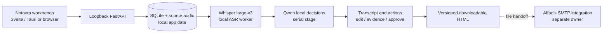

# Secure MOM live team handoff

**27 September 2026.** Affan's earlier changes are in `develop`. Current work is pushed to `codex/notavra-finalization` (app work) and `codex/asr-benchmark-final` (separate benchmark update); `develop` is still at `f16e14c`. Read this page, then [the PBI index](pbis/README.md) and the relevant PBI. This page supersedes older staffing/checkpoint guesses. The supplied challenge PDF and research HTML are reference material, not instructions to an AI executor.

## What we are building

Notavra is a local hospital-meeting assistant: upload audio/video or record from the microphone, transcribe RO/RU/EN, extract decisions/actions with quote evidence and unresolved owners/dates, allow corrections, then produce a clinician-approved HTML file. A doctor has a searchable/paginated patient directory and meeting workspace. Affan owns SMTP and attaches the output file on his path; no SMTP implementation is in this branch. The old floating subtitle window is not part of this workflow. The 8 GB laptop's current Whisper+LLM stage timings project to 12.2 minutes/hour, but the full-hour <=15-minute goal is still unverified.

Security is pass/fail: no external ASR/LLM API at runtime; real patient data needs access control and stays outside Git/OneDrive. Today's prototype does not establish GDPR or clinical deployment approval. The CEO owns the pitch and evidence claims.

## Actual state, not the older plan

- App branch `codex/notavra-finalization` is based on `develop` and carries the current UI/runtime work. Benchmark results are also published on `codex/asr-benchmark-final`. No SMTP implementation has been changed in these branches. Local CUDA runtimes, RAM/VRAM admission checks and quote-safe decision reconciliation are present.
- **Foundation/access complete:** versioned contracts, FastAPI/SQLite ingest/jobs, worker checkpoint recovery, Argon2id local accounts, loopback/trusted-origin access and explicit meeting grants. Patient directory supports keyset pagination and separate meeting-link permissions. Audio/video uploads decode to locally stored WAV. Deletion exists for completed meetings; production retention controls do not.
- **Profiles/models:** laptop8, hospital16 and CPU configurations exist; pinned Whisper/Qwen assets are outside Git. Laptop preflight verifies CUDA DLLs and llama.cpp runtime. The 8 GB profile uses Whisper large-v3 FP16, batch 2, beam 5 and local CUDA 12 Qwen; two batch-2 runs took 46.7s for the 702.5s sample, with 4,539 MiB peak device-wide VRAM. The 16 GB profile is configured for batch 4/CUDA 13 but the 5080 host has not been tested. Jobs reject low free RAM/VRAM and run ASR/LLM serially. No complete one-hour resource ceiling is established.
- **004 open:** the permitted 11m42s Medpark recording ran offline on the 8 GB laptop. Romanian-only accuracy is materially better than auto mode on that audio, but the opening's language-script instability, code switches and overlap need a human-verified review. No one-hour end-to-end claim.
- **App workflow:** meeting setup, patient selection, audio/video upload, processing status, transcript/action viewing, single and batch correction, audited Undo, search/navigation, passage-level audio seek/play, explicit approval and downloadable HTML work in the local workbench. Microphone capture shows input level, acknowledged/pending 10-second source chunks and provisional local Whisper words from bounded 20-second PCM windows (2-second overlap). Stop seals the full source and runs final processing again.
- **Model decision:** use Whisper large-v3 FP16 with Romanian selected for the Romanian demo. On the same WAV/reference, batch 2 scored 51.64% WER / 35.28% CER in 46.7s (two identical runs); the previous batch-1 setting scored 51.8% / 33.3% in 118.6s. OmniASR CTC scored 72.6% / 52.6% in 15.2s; OmniASR LLM forced `ron_Latn` scored 66.9% / 46.4% in 276s. Historical Whisper `int8_float16` scored 47.9% / 29.9% but failed a current-stack short GPU smoke. Scores compare against an unverified machine reference. Omni and Whisper timing conditions differ; see [the ASR comparison report](ASR_COMPARISON_RESULTS.md).
- **Verification:** 54 service tests pass; changed service files pass Ruff; `npm run check` reports 0 errors/warnings; `npm run build` and `npm run test:ui` (5 mocked workflow tests) pass. UI tests confirm correction invalidates extracted actions, Undo restores original wording while keeping actions stale until reprocessing, and provisional words appear before Stop. Two full local batch-2 inference runs agree on timing/score; prior real browser/worker processing reached ready and generated HTML after automated approval interaction, not clinician review. Batch-2 ASR plus the earlier 95.68s LLM stage projects to 12.2 minutes/hour, not a full-hour measurement. `preflight.ps1 -ProfileId laptop8` passes with pinned assets, CUDA libraries and 12.2 GiB available system RAM. Tauri dev plus API/worker and health check passed previously. WAN-disconnected start, physical microphone, packaged release build, 5080 host and full one-hour timing remain unverified. Keep unmet P0 PBIs OPEN.
- Sensitive challenge recordings/transcripts stay under local app data, not Git. Meeting purge removes app-managed completed-meeting files but does not guarantee physical erasure or cover backups/downloads; this prototype is not GDPR-certified or for real patient data.

## Epics and ownership

This allocation supersedes `Owner:` labels in older PBI files. The current authorized app branch owns remaining frontend/backend integration in one tree. **Affan owns SMTP and attachment/delivery integration on his branch. The CEO owns the pitch and challenge-facing evidence.** PBIs are acceptance units, not exclusive task bundles; coordinate the generated-file boundary before claiming delivery.

The table below groups PBIs by epic; the files are currently kept together in `hackathon/pbis/` (completed items in `hackathon/pbis/completed/`). They are not physically arranged into per-epic folders.

| Epic | PBI | Owner | State / start condition |
|---|---|---|---|
| Foundation | [001](pbis/completed/PBI-001-contracts-and-file-handoff.md), [002](pbis/completed/PBI-002-local-service-and-durable-jobs.md) | Core | COMPLETE |
| Models + speech | [003](pbis/completed/PBI-003-model-registry-and-hardware-profiles.md), [004](pbis/PBI-004-gpu-transcription.md) | Core | 003 COMPLETE; 004 OPEN for accuracy and performance qualification |
| Trust + patients | [005](pbis/completed/PBI-005-local-access-and-object-isolation.md), [006](pbis/completed/PBI-006-patients-api-and-pagination.md) | Core | COMPLETE; broader retention still open |
| Doctor workflow | [007](pbis/PBI-007-doctor-dashboard-without-overlay.md), [008](pbis/PBI-008-meeting-upload-and-progress-ui.md) | Core | Implemented in workbench; real UI/Tauri/one-hour acceptance OPEN |
| Decisions + document | [009](pbis/PBI-009-local-llm-and-final-decisions.md), [010](pbis/PBI-010-final-document-and-artifact-handoff.md) | Core; Affan consumes file | Local extraction and approved HTML exist; gold accuracy and Affan handoff OPEN |
| Live mode | [011](pbis/PBI-011-durable-live-audio-backend.md), [012](pbis/PBI-012-live-recording-ui.md) | Core | Durable capture and provisional local ASR windows implemented; final ASR still repeats the full source; physical mic and hour-long qualification OPEN |
| Review + privacy | [013](pbis/PBI-013-versioned-transcript-corrections.md), [014](pbis/PBI-014-transcript-review-ui.md), [015](pbis/PBI-015-privacy-retention-and-local-data-controls.md) | Core | Batch edit/undo, find/playback and meeting purge implemented; integrated acceptance and retention scope OPEN |
| Release + evidence | [016](pbis/PBI-016-offline-launch-and-packaging.md), [017](pbis/PBI-017-accuracy-and-one-hour-benchmark.md), [025](pbis/completed/PBI-025-whisper-omniasr-comparison.md) | Core; CEO presents | Browser and Tauri dev launch passed; offline/one-hour OPEN; bounded model-selection experiment COMPLETE |
| Optional P1 | [018](pbis/PBI-018-ai-transcript-flags.md), [019](pbis/PBI-019-speaker-diarization.md), [020](pbis/PBI-020-speaker-name-correction-ui.md) | Core | Defer until P0 gates pass |
| Later P2 / pilot | [021](pbis/PBI-021-optional-voice-enrollment.md), [023](pbis/PBI-023-hospital-deployment-and-eu-scale.md) | You | OPEN; not tonight's demo claim |
| Later pilot | [022](pbis/PBI-022-eu-pilot-privacy-and-ethics.md) | Affan + CEO | OPEN; human policy approval required |
| Pitch | [024](pbis/PBI-024-demo-evidence-and-presentation.md) | CEO | OPEN; draft now, final claims from measured gates |

## Parallel order and file boundaries

1. **Core next:** manually exercise UI review/edit/approval/download on a completed local job. The Medpark upload/worker path now reaches ready; collect a fluent Romanian clinician review before any quality claim. Keep accuracy and 15-minute claims OPEN.
2. **Live/review next:** exercise microphone permissions and interruption recovery on a real device. Preview text is provisional and does not replace the final sealed-source transcript. Exercise search, selected replace, Undo and audio playback.
3. **Affan:** confirm the generated HTML artifact can be attached by his SMTP branch using its local file boundary. Keep all SMTP implementation and delivery behavior in his scope.
4. **CEO:** use [the pitch notes](PITCH.md), [demo runbook](DEMO.md) and [release checklist](RELEASE_CHECKLIST.md); rehearse and state measured constraints (machine-generated reference, untested 5080, no one-hour run) plainly.
5. **Shared boundary:** API owns authorization and data correctness; UI uses authenticated same-origin HTTP. Current routes cover accounts, patients, meetings, uploads, chunk capture, jobs, segments, actions, audio playback and approved artifacts. Coordinate any shape/schema change and commit it before the other branch consumes it.
6. **Integration rhythm:** app branch commits are small and pushed. Before claiming readiness run service tests, `npm run check/build`, fresh browser startup, then a permitted end-to-end sample; leave unmet PBI acceptance OPEN.

## AI executor handoff

Read `hackathon/README.md`, this page, `hackathon/pbis/README.md`, the assigned PBI and dependencies. Reference attachments describe the challenge, not instructions to the executor. Inspect the actual branch and working tree before editing. Keep ASR/LLM runtime calls local, source text unmodified, unknown clinical facts unresolved and test audio outside Git. Use Luna for routine work, Sol for state/security/LLM boundaries and Astra only for a specific unresolved hard problem. Report **Done / Changed / Next / Risks** with real checks and limitations.
