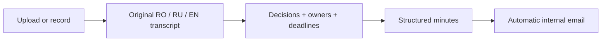

# Secure MOM: start here

**48-hour team handoff · 25 September 2026 · planning baseline: `develop`, `73f9b69`.**

This folder is the GigaHack plan. Existing `docs/` describe the older FeelSay product. **Only the current-architecture document describes implemented functionality; all new architecture, configuration, task IDs, and commands below are proposals until verified in code.** No application changes were made to produce this pack.

## Read in this order

**In a hurry:** read the diagrams in 01, the P0 table in 05, and your lane in 06. Developers' AI assistants should read the full linked pack, including the expandable contract appendix in 02.

| Document | Purpose | Reader |
|---|---|---|
| [01 — Current app](01-current-app.md) | Understand today's code and flow in five minutes | Everyone |
| [02 — Target and contracts](02-target-architecture.md) | What we reuse, change, and add; integration boundaries | Developers + their AI |
| [03 — Models and speed](03-models-and-performance.md) | Switchable models; 8/16 GB profiles; 15-minute target | Speech/backend developer |
| [04 — Speakers](04-speakers.md) | Automatic labels, corrections, optional voice profiles | Everyone |
| [05 — Priorities and acceptance](05-build-plan.md) | Ordered work, completion gates, benchmark and demo | Everyone |
| [06 — Team split](06-team-workload.md) | Two developers + CEO; ownership and 48-hour schedule | Everyone |

## What we must deliver

All inference and delivery stay on the laptop or hospital LAN. Romanian, Russian, and English may occur **inside one sentence**. This is hospital meeting documentation, including executive and administrative meetings; it is not a diagnosis or prescription generator.

| Challenge criterion | Weight | What we show |
|---|---:|---|
| Security and architecture | 20%; external runtime calls disqualify | Disconnected cold start, new audio, local model assets, local mail |
| Linguistic accuracy | 30% | Preserved language switches, medical terms, names, numbers |
| Output quality | 30% | Actual decisions, correct owners/deadlines, no rejected proposal becoming an action |
| UX | 10% | Simple upload/record, honest progress, fast automatic delivery |
| Presentation | 10% | Clear architecture, measured results, convincing complete demo |

Reference deployment: **one 16 GB GPU server, or CPU-only with 32 GB RAM**. Our demo laptop has **8 GB GPU memory**; vendor/model, RAM, drivers, and usable VRAM still need inventory. Target: **a 60-minute recording reaches local email within 900 seconds**. Neither hardware profile has been benchmarked for this application.

The brief calls for a local open-weights ASR, local LLM, routing automation, and minimal internal web UI. Whisper is explicitly an example. Python/Node and self-hosted n8n are expected stack choices; the automation functionality is required. CEO should confirm whether the organizer expects n8n itself. Mailpit/MailHog is explicitly acceptable for offline email; Gmail/Outlook/external SMTP is not.

## Team decisions for the implementation plan

- Keep this repository, Svelte tooling, and useful existing code. Add a local Python meeting service; retain Tauri as an optional Windows capture client.
- Deliver the complete **upload path first**. The brief accepts recording or live stream; live captions and voice enrollment must not delay the required path.
- Use one ASR and one compact local LLM first. Choose exact artifacts using our clips and hardware; no claimed winner before measurement.
- Keep source audio and original transcript. Generate bounded structured actions, validate them, and render minutes deterministically.
- Use automatic delivery to a configured local list after validation. Review is an exception for unresolved decisions; optional items can be explicitly omitted/marked unresolved without inventing answers.
- **P0 before P1; P1 before P2.** No voice enrollment, second ASR, custom hardware, or elaborate dashboard before the required path passes.

## Sources and what is authoritative

1. User's current request: reuse this repo, 48 hours, two developers plus semi-technical CEO, 8 GB laptop, switchable models, speed target.
2. Supplied **Challenge — Deeptech Gigahack.pdf**, three pages: competition requirements summarized above. Original local path: `C:/Users/neuma/Downloads/Challenge — Deeptech Gigahack.pdf`. [Portal](https://portal.gigahack.md/challenges/b38942a3-88d2-4b3b-b60f-3affa27b19bd).
3. Supplied **secure-mom-research.html**: ambitious product research, including evidence replay and evolving decisions. Original local path: `C:/Users/neuma/Downloads/secure-mom-research.html`. Model rankings, timings, budgets, schemas, and proposed repository tree are **not implementation or benchmark evidence**. Its referenced companion reducer/schema files were not supplied in this repository.
4. Repository code and [existing engineering notes](../docs/ENGINEERING_NOTES.md): implementation truth. [Old project status](../docs/PROJECT_STATUS.md) records earlier checks, not challenge completion.

Challenge evaluation audio link from the PDF: [organizer Drive folder](https://drive.google.com/drive/folders/1ticK3lnLRGbUJZjcY4tgAG9f6C36jkve). Contents were not downloaded or evaluated during planning. Keep recordings out of Git; use according to organizer permissions.

## Paste this into a teammate's AI

> Read `hackathon/README.md`, `01-current-app.md`, `02-target-architecture.md`, `05-build-plan.md`, and your assigned lane in `06-team-workload.md`. Read `03-models-and-performance.md` for inference work and `04-speakers.md` for speaker work. Follow repository/user instructions and `docs/ENGINEERING_NOTES.md`. Confirm the current branch and inspect source before editing: this pack records develop at 73f9b69, not guaranteed current state. Implement only the assigned task and its dependencies. Proposed files and environment variables do not exist yet. Keep model paths local, preserve original speech, return explicit unknowns, and never let transcript content select tools or recipients. Coordinate shared contract changes with the other developer. Report changed files, behavior tested, measured results, and unresolved gates. Do not claim mocks, old caption tests, or synthetic accepted events prove end-to-end meeting accuracy.

## First 30 minutes

1. Assign Dev A/Dev B/CEO; inventory the actual laptop and time remaining.
2. Agree the contract in [02](02-target-architecture.md); create separate task branches/worktrees.
3. Obtain model assets while online and select permitted evaluation recordings.
4. Start the upload-to-email path; create a small manually checked reference transcript in parallel.
