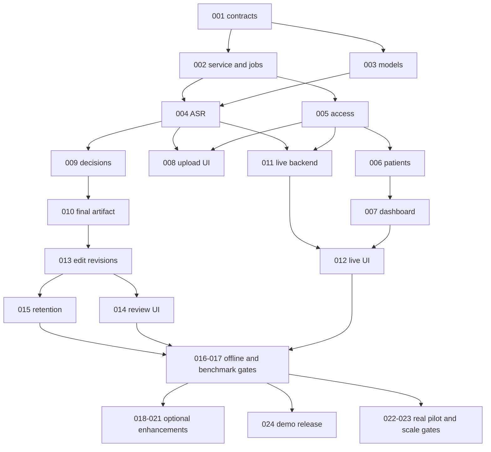

# Secure MOM execution backlog

**26 September 2026 · finish today's demo today · inspected develop: eb4d808.**

This index supersedes the older H01–H17 task order and 48-hour staffing assumptions. All PBIs are OPEN: the inspected branch has the caption app and docs, with no new meeting service/patient dashboard. Affan's private branch may contain separate work; do not overwrite it.

## Scope and authority

Today's requested app: doctor dashboard with searchable paginated patients, audio/video upload, live recording and inline transcript, local multilingual ASR, final decisions/owners/deadlines, manual corrections, professional output file, privacy controls and measured offline performance. **The floating subtitle window has no place in the new doctor workflow.**

Affan owns mailing. Our boundary is a finalized file with stable ID/revision/checksum and ready/superseded/revoked status. HTML is a proposal until he confirms format. Agree how he receives the path/artifact; this backlog contains no SMTP/routing/outbox/retry implementation. File-ready is not proof of challenge email completion: observe the combined result with Affan before claiming the 15-minute end-to-end gate.

P0 = required today, including user-added patients/live/editing and CEO presentation. P1 = optional only after all P0 gates pass. P2 and pilot/scale gates cover the full product direction but are not promised today. A production EU healthcare rollout cannot be inferred from today's working prototype. Patient dashboard is a lightweight authorized directory/document view, not a complete EHR; hospital meetings remain valid without a patient link.

## Start now

1. **Luna: PBI-001** freezes contracts and file fixture. In parallel work outside shared files, prepare **PBI-003** model assets/hardware checks. No model execution agents were spawned while authoring this plan.
2. **Sol: PBI-002**, then **PBI-004** gets a real file transcribed on the 3070 Ti. This is the first technical gate, before broad UI polishing.
3. **Luna: PBI-007/008** can develop against PBI-001 fixtures while the service is built. Complete acceptance only against real endpoints. **Sol: PBI-005** protects all real endpoints; synthetic development mode is not a production bypass.
4. **Sol: PBI-009**, then **Luna: PBI-010** delivers the first real output file to Affan. Integrate early rather than waiting for optional features.
5. Complete remaining P0, run PBI-017, freeze. CEO works on PBI-024 throughout.

## Model budget rules

- **GPT-6 Luna is the default executor:** schema fixtures, UI, patient CRUD/search/pagination, configuration, rendering, launch scripts, benchmark tooling and documentation.
- **GPT-6 Sol handles the difficult boundaries:** capture/jobs concurrency, GPU integration, grounded decision semantics, permissions, transactional revisions/deletion. Use the assigned reasoning level; bounded failures can escalate from Luna to Sol.
- **GPT-6 Astra plans only by default.** No PBI is assigned to Astra implementation. Escalate only an isolated unresolved issue after Sol has produced concrete evidence that deeper analysis is needed, and let the user choose whether to spend the extra credits. Do not send the whole app to Astra for convenience.
- One task at a time per working tree. Separate sessions/worktrees may handle independent tasks with explicit file ownership; never run competing schema/lockfile edits. These are execution recommendations, not permission to start hidden agent work.

## Today: realistic checkpoints

Planning written around 13:30 Europe/Warsaw; adjust against actual remaining time. These are stop/checkpoints, not guaranteed engineering estimates. With Affan focused on mail, app work is primarily **one developer plus AI**, not two full app developers. There is substantial new code; do not claim the entire roadmap can certainly finish today.

| Local checkpoint | Required visible evidence | Action if behind |
|---|---|---|
| 15:00 | Real short audio -> timed local transcript; contracts agreed | Solve runtime/model issue with Sol; defer UI polish |
| 17:00 | New short audio -> structured final file; Affan can consume it | Focus on extraction/artifact integration; no extras |
| 19:00 | Dashboard/patient search/pages, upload and live flow integrated; access boundaries working | Finish missing P0, explicitly record risk to today's full scope |
| 21:00 | Manual corrections/privacy checks and first hour benchmark complete | Freeze optional work; fix largest gate failure |
| 22:00 | Release candidate, repeat offline test; CEO rehearsal | Only targeted regression fixes |
| By local end of day | Qualified runnable demo and honest completion record | Leave unmet PBIs OPEN; never redefine a missing requirement as done |

If the required scope does not fit, surface which P0 gates are still missing immediately. Keep working on required behavior; user decides any scope reduction. All future PBIs remain documented for handoff.

## Task index

| PBI | Priority | Executor / reasoning | Dependencies | Status |
|---|---|---|---|---|
| [001 — Freeze app contracts and Affan's output-file boundary](PBI-001-contracts-and-file-handoff.md) | P0 | Luna / Medium | None | OPEN |
| [002 — Create local API, storage and restartable jobs](PBI-002-local-service-and-durable-jobs.md) | P0 | Sol / High | 001 | OPEN |
| [003 — Prepare local model registry and 8/16 GB profiles](PBI-003-model-registry-and-hardware-profiles.md) | P0 | Luna / High | 001 | OPEN |
| [004 — Transcribe real audio on the laptop GPU](PBI-004-gpu-transcription.md) | P0 | Sol / High | 002, 003 | OPEN |
| [005 — Protect patients, meetings and source media](PBI-005-local-access-and-object-isolation.md) | P0 | Sol / High | 001, 002 | OPEN |
| [006 — Create a minimal searchable patient directory](PBI-006-patients-api-and-pagination.md) | P0 | Luna / High | 001, 002, 005 | OPEN |
| [007 — Replace the caption home with the doctor dashboard](PBI-007-doctor-dashboard-without-overlay.md) | P0 | Luna / Medium | 001; integrate 005 and 006 | OPEN |
| [008 — Connect audio/video upload to real processing](PBI-008-meeting-upload-and-progress-ui.md) | P0 | Luna / Medium | 002, 004, 005; fixture development after 001 | OPEN |
| [009 — Extract evidence-backed final decisions locally](PBI-009-local-llm-and-final-decisions.md) | P0 | Sol / High | 001, 003, 004 | OPEN |
| [010 — Generate a final document for Affan](PBI-010-final-document-and-artifact-handoff.md) | P0 | Luna / High | 001, 009; fixture rendering can start immediately | OPEN |
| [011 — Persist live audio and transcribe completed windows](PBI-011-durable-live-audio-backend.md) | P0 | Sol / High | 002, 004, 005 | OPEN |
| [012 — Record and view live transcripts in the main app](PBI-012-live-recording-ui.md) | P0 | Luna / Medium | 007, 011 | OPEN |
| [013 — Apply transcript corrections and rebuild dependent output](PBI-013-versioned-transcript-corrections.md) | P0 | Sol / High | 002, 009, 010 | OPEN |
| [014 — Deliver manual review, audio replay and bulk correction](PBI-014-transcript-review-ui.md) | P0 | Luna / High | 008, 013 | OPEN |
| [015 — Control local sensitive data and retention](PBI-015-privacy-retention-and-local-data-controls.md) | P0 | Sol / High | 002, 005, 010, 013 | OPEN |
| [016 — Launch the complete app offline from prepared assets](PBI-016-offline-launch-and-packaging.md) | P0 | Luna / High | 003, 005, 007, 008, 010, 012 | OPEN |
| [017 — Qualify language accuracy and one-hour performance](PBI-017-accuracy-and-one-hour-benchmark.md) | P0 | Luna / High | 004, 009, 010, 012, 016; collect references earlier | OPEN |
| [018 — Suggest focused transcript corrections](PBI-018-ai-transcript-flags.md) | P1 | Sol / High | 009, 013, 014, 017 | OPEN |
| [019 — Add anonymous speaker turns](PBI-019-speaker-diarization.md) | P1 | Sol / High | 004, 017 | OPEN |
| [020 — Map and correct speaker labels](PBI-020-speaker-name-correction-ui.md) | P1 | Luna / High | 019, 013 | OPEN |
| [021 — Qualify optional returning-speaker voice profiles](PBI-021-optional-voice-enrollment.md) | P2 | Sol / High | 019, 020, 015, 022 | OPEN |
| [022 — Prepare the privacy and ethics gate for a real pilot](PBI-022-eu-pilot-privacy-and-ethics.md) | Before real patient use | Luna / High | 001, 005, 015; does not block synthetic demo | OPEN |
| [023 — Qualify hospital deployment and expansion](PBI-023-hospital-deployment-and-eu-scale.md) | After hackathon / before scaled deployment | Sol / High | 016, 017, 022 | OPEN |
| [024 — Freeze the release and present measured results](PBI-024-demo-evidence-and-presentation.md) | P0 | Luna / Medium | Draft now; final claims depend on completed P0 and 017 | OPEN |

## Dependencies at a glance

The graph is a summary; each PBI's dependency list governs. PBI-022 evidence inventory starts now, but its human/legal acceptance is a separate real-data release gate. PBI-024 drafts start now and final claims wait for measured results.

## Ownership and integration

- You own the core app, contracts, service, UI and patient data controls. Assign individual bounded tasks to Luna/Sol as above.
- Affan owns sending the file. Do not edit his modules, select his mail architecture or create substitute delivery code. Coordinate the file boundary only.
- CEO collects permitted/synthetic test material and human references, updates acceptance evidence, checks organizer details, writes pitch and rehearses. CEO/DPO/hospital IT own policy approvals where engineering cannot decide.
- Contracts/migrations/lockfiles have one owner per session. Other tasks consume frozen fixtures. Integrate through small commits and note interface changes before another branch consumes them.

## Completion and archive rules

1. Fill the PBI's completion record with commit, exact checks, real outcomes and remaining limitations.
2. Set Status to COMPLETE only if its acceptance passes; a dependency or unverified end-to-end requirement keeps it open.
3. Move the file to `hackathon/pbis/completed/`, preserving its ID/name. Update this index's link/status to the new location and any relative references. Never renumber or reuse IDs.
4. Keep evidence files outside Git if they contain sensitive audio/transcripts; reference permitted summaries/hashes in the PBI.
5. Report progress using **Done / Changed / Next / Risks**. Mark mocked tests separately from real-model/native/offline runs.

Suggested executor prompt: “Read hackathon/pbis/README.md and PBI-XXX. Inspect current source and prerequisites. Implement that slice using the assigned model, preserve unrelated work, run its targeted validation, and update its completion record. No mailing implementation. Ask only for genuinely missing required decisions.”

