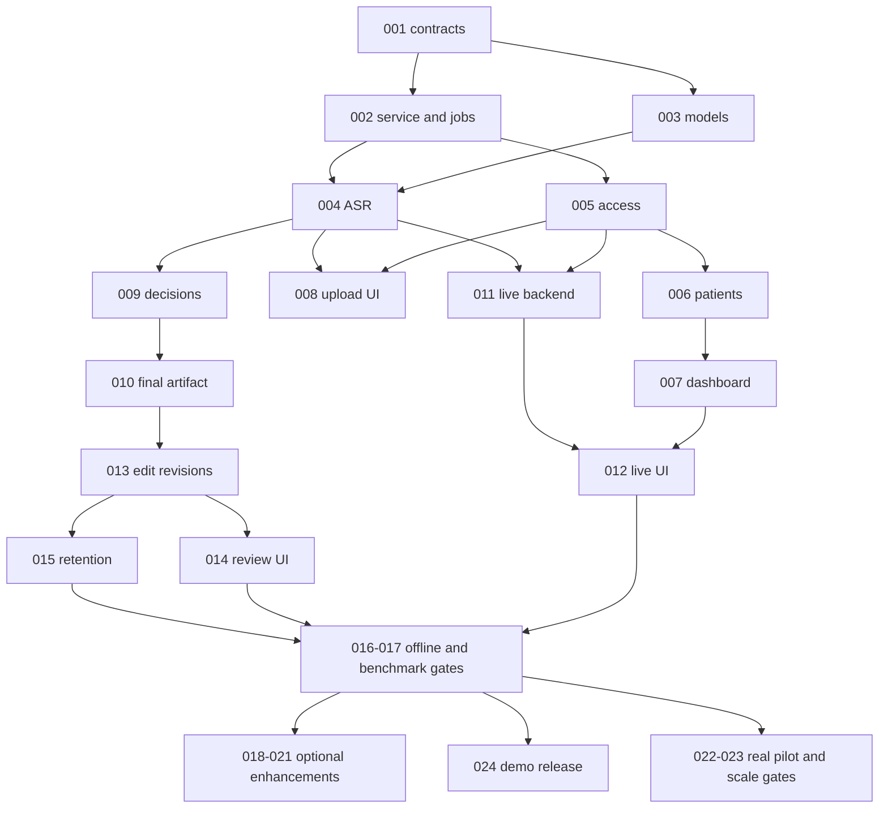

# Secure MOM execution backlog

**27 September 2026; implementation and benchmark are integrated into `develop`; active continuation is `codex/notavra-finalization`.** The comparison branch contains the app integration, local GPU/memory guards, bounded evidence-linked extraction, and PBI-025/PBI-017 results.

This index supersedes older task order and owner guesses in individual PBIs. PBIs 001–003 and 005–006 are complete; PBI-025's bounded model-selection experiment is complete. A real Romanian upload has completed ASR and local decision extraction on the laptop. The latest uploaded-audio batch-2 ASR+LLM stage sum projects to 20.0 minutes/hour, so the <=15-minute goal is not met and remains unverified on a full-hour recording. Microphone recording shows provisional Whisper windows while preserving acknowledged source chunks; final processing reuses matching windows and fills gaps from the saved source. Clinician review, a one-hour run, 5080 validation and verified email delivery remain open. The benchmark recommends Whisper large-v3 with Romanian selected for this Romanian sample. [The live team handoff](../10-team-handoff.md) contains current branch state and integration boundaries. Affan owns SMTP and delivery acceptance.

## Scope and authority

Today's requested app: doctor dashboard with searchable paginated patients, audio/video upload, live recording and inline transcript, local multilingual ASR, final decisions/owners/deadlines, manual corrections, professional output file, privacy controls and measured offline performance. **The floating subtitle window has no place in the new doctor workflow.**

Affan owns mailing. Our boundary is a finalized file with stable ID/revision/checksum and ready/superseded/revoked status. HTML is a proposal until he confirms format. Agree how he receives the path/artifact; this backlog contains no SMTP/routing/outbox/retry implementation. File-ready is not proof of challenge email completion: observe the combined result with Affan before claiming the 15-minute end-to-end gate.

P0 = required today, including user-added patients/live/editing and CEO presentation. P1 = optional only after all P0 gates pass. P2 and pilot/scale gates cover the full product direction but are not promised today. A production EU healthcare rollout cannot be inferred from today's working prototype. Patient dashboard is a lightweight authorized directory/document view, not a complete EHR; hospital meetings remain valid without a patient link.

## Current next work

1. **Rehearse the clinician flow in the UI:** setup/login → patient/meeting → upload or microphone capture with provisional words → local ASR → local decisions → correction/reprocess → approve and download HTML. A real upload/worker run reaches `ready`; manually test UI review, edits, approval and file output. Use only synthetic or explicitly permitted audio.
2. **Qualify the release claims:** keep Romanian selected for Medpark. PBI-025 reports Whisper vs OmniASR disagreement on the same challenge file, but the Microsoft reference is machine-generated and unverified. Do not report this as clinical WER. Keep the one-hour/15-minute criterion OPEN until a full one-hour local pipeline run is measured.
3. **Close remaining P0 integration gaps:** verify Affan can attach the downloaded artifact on his own SMTP path; physically test microphone recording, review/search/replacement and Tauri on the demo laptop; prepare and test WAN-disconnected launch. Email implementation remains Affan's responsibility.
4. **CEO:** finish the pitch and rehearse, with measured facts only. Security is pass/fail; say clearly that the prototype is local-first but is not GDPR-certified or cleared for real patient data.

The user authorized the current implementation branch to finish frontend and backend together. Affan owns SMTP and its output-file intake; the current app generates a human-approved downloadable file. Preserve that boundary. Freeze payload changes in the existing API contracts and update PBIs after each increment; only one developer edits shared contracts/storage/migrations per commit.

## Model budget rules

- **GPT-6 Luna is the default executor:** schema fixtures, UI, patient CRUD/search/pagination, configuration, rendering, launch scripts, benchmark tooling and documentation.
- **GPT-6 Sol handles the difficult boundaries:** capture/jobs concurrency, GPU integration, grounded decision semantics, permissions, transactional revisions/deletion. Use the assigned reasoning level; bounded failures can escalate from Luna to Sol.
- **GPT-6 Astra plans only by default.** No PBI is assigned to Astra implementation. Escalate only an isolated unresolved issue after Sol has produced concrete evidence that deeper analysis is needed, and let the user choose whether to spend the extra credits. Do not send the whole app to Astra for convenience.
- One task at a time per working tree. Separate sessions/worktrees may handle independent tasks with explicit file ownership; never run competing schema/lockfile edits. These are execution recommendations, not permission to start hidden agent work.

## Today's gates

Use [the live handoff](../10-team-handoff.md) for the current parallel order. A local model run, fixture renderer or SMTP unit test is not an end-to-end pass. Complete the P0 acceptance gates, measure the one-hour offline path with Affan, and leave any unmet PBI OPEN.

## Task index

| PBI | Priority | Executor / reasoning | Dependencies | Status |
|---|---|---|---|---|
| [001 — Freeze app contracts and Affan's output-file boundary](completed/PBI-001-contracts-and-file-handoff.md) | P0 | Luna / Medium | None | COMPLETE |
| [002 — Create local API, storage and restartable jobs](completed/PBI-002-local-service-and-durable-jobs.md) | P0 | Sol / High | 001 | COMPLETE |
| [003 — Prepare local model registry and 8/16 GB profiles](completed/PBI-003-model-registry-and-hardware-profiles.md) | P0 | Luna / High | 001 | COMPLETE |
| [004 — Transcribe real audio on the laptop GPU](PBI-004-gpu-transcription.md) | P0 | Sol / High | 002, 003 | OPEN |
| [005 — Protect patients, meetings and source media](completed/PBI-005-local-access-and-object-isolation.md) | P0 | Sol / High | 001, 002 | COMPLETE |
| [006 — Create a minimal searchable patient directory](completed/PBI-006-patients-api-and-pagination.md) | P0 | Luna / High | 001, 002, 005 | COMPLETE |
| [007 — Replace the caption home with the doctor dashboard](PBI-007-doctor-dashboard-without-overlay.md) | P0 | Luna / Medium | 001; integrate 005 and 006 | OPEN |
| [008 — Connect audio/video upload to real processing](PBI-008-meeting-upload-and-progress-ui.md) | P0 | Luna / Medium | 002, 004, 005; fixture development after 001 | OPEN |
| [009 — Extract evidence-backed final decisions locally](PBI-009-local-llm-and-final-decisions.md) | P0 | Sol / High | 001, 003; 004 for audio-to-decisions acceptance | OPEN |
| [010 — Generate a final document for Affan](PBI-010-final-document-and-artifact-handoff.md) | P0 | Luna / High | 001, 009; fixture rendering can start immediately | OPEN |
| [011 — Persist live audio and transcribe completed windows](PBI-011-durable-live-audio-backend.md) | P0 | Sol / High | 002, 004, 005 | OPEN |
| [012 — Record and view live transcripts in the main app](PBI-012-live-recording-ui.md) | P0 | Luna / Medium | 007, 011 | OPEN — preview/reuse implemented; physical microphone and one-hour target performance unverified |
| [013 — Apply transcript corrections and rebuild dependent output](PBI-013-versioned-transcript-corrections.md) | P0 | Sol / High | 002, 009, 010 | OPEN |
| [014 — Deliver manual review, audio replay and bulk correction](PBI-014-transcript-review-ui.md) | P0 | Luna / High | 008, 013 | OPEN |
| [015 — Control local sensitive data and retention](PBI-015-privacy-retention-and-local-data-controls.md) | P0 | Sol / High | 002, 005, 010, 013 | OPEN |
| [016 — Launch the complete app offline from prepared assets](PBI-016-offline-launch-and-packaging.md) | P0 | Luna / High | 003, 005, 007, 008, 010, 012 | OPEN |
| [017 — Qualify language accuracy and one-hour performance](PBI-017-accuracy-and-one-hour-benchmark.md) | P0 | Luna / High | 004, 009, 010, 012, 016; collect references earlier | OPEN |
| [018 — Suggest focused transcript corrections](PBI-018-ai-transcript-flags.md) | P1 | Sol / High | 009, 013, 014, 017 | OPEN |
| [019 — Add anonymous speaker turns](PBI-019-speaker-diarization.md) | P1 | Sol / High | 004, 017 | OPEN |
| [020 — Map and correct speaker labels](PBI-020-speaker-name-correction-ui.md) | P1 | Luna / High | 019, 013 | OPEN |
| [021 — Qualify optional returning-speaker voice profiles](PBI-021-optional-voice-enrollment.md) | P2 | Sol / High | 019, 020, 015, 022 | OPEN |
| [022 — Prepare the privacy and ethics gate for a real pilot](PBI-022-eu-pilot-privacy-and-ethics.md) | Before real patient use | Luna / High | 001, 005, 015; does not block synthetic demo | OPEN |
| [023 — Qualify hospital deployment and expansion](PBI-023-hospital-deployment-and-eu-scale.md) | After hackathon / before scaled deployment | Sol / High | 016, 017, 022 | OPEN |
| [024 — Freeze the release and present measured results](PBI-024-demo-evidence-and-presentation.md) | P0 | Luna / Medium | Draft now; final claims depend on completed P0 and 017 | OPEN |
| [025 — Compare Whisper and OmniASR on identical Medpark audio](completed/PBI-025-whisper-omniasr-comparison.md) | P0 experiment | Luna / High | 003; consumes 004 baseline, supplies 017 | COMPLETE — single-recording scope |

PBI-025 is a bounded core inference/evaluation experiment with concrete local input hashes and a reproducible harness. It does not change the production model or replace PBI-017's one-hour end-to-end gate.

## Dependencies at a glance

```mermaid
flowchart TD
    C[001 contracts] --> S[002 service and jobs]
    C --> M[003 models]
    S --> A[004 ASR]
    M --> A
    S --> AUTH[005 access]
    AUTH --> P[006 patients]
    P --> UI[007 dashboard]
    A --> UP[008 upload UI]
    AUTH --> UP
    A --> L[009 decisions]
    L --> F[010 final artifact]
    A --> LIVE[011 live backend]
    AUTH --> LIVE
    LIVE --> LUI[012 live UI]
    UI --> LUI
    F --> E[013 edit revisions]
    E --> R[014 review UI]
    E --> PRIV[015 retention]
    PRIV --> G[016-017 offline and benchmark gates]
    R --> G
    LUI --> G
    G --> OPT[018-021 optional enhancements]
    G --> DEMO[024 demo release]
    G --> PILOT[022-023 real pilot and scale gates]
```

The graph is a summary; each PBI's dependency list governs. PBI-022 evidence inventory starts now, but its human/legal acceptance is a separate real-data release gate. PBI-024 drafts start now and final claims wait for measured results.

## Ownership and integration

- Current developer ownership is in [the live handoff](../10-team-handoff.md); it supersedes old Owner labels in individual PBI files.
- Core owns service, API, storage and model/inference work. Affan owns every screen and frontend integration, plus his SMTP code. PBIs remain acceptance units, so some have both owners. Coordinate the artifact interface; do not duplicate his mail implementation.
- CEO collects permitted/synthetic test material and human references, updates acceptance evidence, checks organizer details, writes pitch and rehearses. CEO/DPO/hospital IT own policy approvals where engineering cannot decide.
- Contracts/migrations/lockfiles have one owner per session. Other tasks consume frozen fixtures. Integrate through small commits and note interface changes before another branch consumes them.

## Completion and archive rules

1. Fill the PBI's completion record with commit, exact checks, real outcomes and remaining limitations.
2. Set Status to COMPLETE only if its acceptance passes; a dependency or unverified end-to-end requirement keeps it open.
3. Move the file to `hackathon/pbis/completed/`, preserving its ID/name. Update this index's link/status to the new location and any relative references. Never renumber or reuse IDs.
4. Keep evidence files outside Git if they contain sensitive audio/transcripts; reference permitted summaries/hashes in the PBI.
5. Report progress using **Done / Changed / Next / Risks**. Mark mocked tests separately from real-model/native/offline runs.

Suggested executor prompt: “Read hackathon/pbis/README.md and PBI-XXX. Inspect current source and prerequisites. Implement that slice using the assigned model, preserve unrelated work, run its targeted validation, and update its completion record. No mailing implementation. Ask only for genuinely missing required decisions.”

